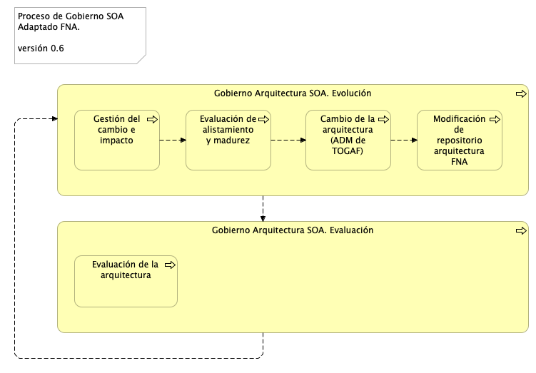

# Separación de Conceptos y Procesos de Arquitectura e Ingeniería
Iniciamos por separar los conceptos pertinentes a la arquitectura y a la ingeniería para luego desarrollar con claridad y mayor libertad los temas de la primera, como son el flujo de trabajo de mantenimiento de arquitecturas.

Definimos en este proyecto a la gestión de las arquitecturas de referencia del FNA como un enfoque centrado en modelos para desarrollar, mantener y entregar soluciones de arquitectura independiente de otros métodos y productos de la ingeniería de sistemas. Distinto a esta última, el foco de la arquitectura no es la construcción, _si no que esta se enfoca más en el conjunto integrado de propiedades sistémicas que en los aportes de las ingenierías individuales_, que son las que implementan y despliegan los artefactos ejecutables.

    Importante. La distinción de la arquitectura (respecto de la ingeniería), en este contexto, es el foco en integrar propiedades de los sistemas, y la optimización de estos, entre todas las contribuciones de ingenierías independientes, como datos, infraestructura, redes, entre otras.

Sin perjuicio de esta separación que establecemos para el trabajo de este proyecto, la gestión y desarrollo de arquitecturas de referencias (en adelante arquitectura de referencia FNA, que incluye en el alcance de este proyecto a servicios SOA, herramientas de software y componentes), _por estar inmersa en la disciplina de ingeniería de sistemas, aunque independiente_, hereda muchas de las formas de trabajo de esta última, además de los cuidados de calidad que a esta se le exigen. Por ejemplo, desde la perspectiva de sistemas en la que se encuentra inmersa el desarrollo de arquitecturas del FNA, esta hace foco en las propiedades sistémicas (o características de calidad no funcional), entre las que se incluyen a la funcionalidad, estructura, rendimiento, seguridad, confiabilidad.

Esta necesaria separación de conceptos facilita el operar las arquitecturas, y en particular objetivo de este proyecto, las arquitecturas de referencia FNA con mayor libertad y profundidad, lo cual a su vez le reportará a la oficina de arquitectura del FNA las eficiencias específicas de esta disciplina.

{#fig:procesosarq.png width=}

 
