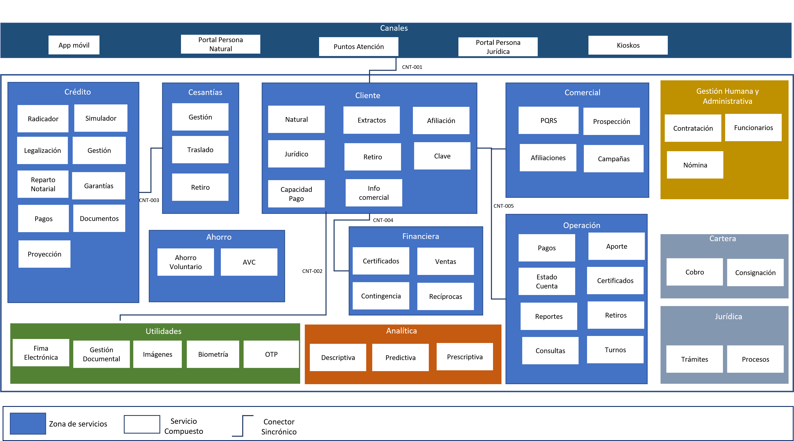

\newpage

| Tema           | $PR12_NOMBRE: **Flujo de trabajo del mantenimiento de la arquitectura de referencia** |
|----------------|----------------------------------------------------------------------|
| Palabras clave | SOA, Arquitectura de referencia, características, dominios, servicios, aplicaciones, datos, |
| Autor          |                                                              |
| Fuente         |                                                              |
| Versión        | **1.$COMMIT** del $FECHA_COMPILACION                         |
| Vínculos       | [Ejecución Plan de Trabajo SOA](onenote:#N001d.sharepoint.com); [Procesos de Negocio FNA](onenote:#N003a.com)|

 

# Diseño y Representación de las Arquitecturas de Referencia 2.0 del FNA
Partimos de la representación de la vista general actual de la arquitectura del FNA, la misma que implica a las problemáticas diagnosticadas en Fase I @eservices1-22 (ver Resumen de problemas diagnosticados, E-Service, Fase I, 2022 en @eservices4-22). Sobre este plano realizaremos luego las propuestas de las vistas funcionales que fungen como arquitecturas de referencia en tanto que proyectan el entendimiento funcional destino útil para enfrentar dichas problemáticas planteadas en @eservices1-22, eservices3-22 y @eservices4-22, y que se resumen en las siguientes.

1. Dependencia de proveedor (OBJ1)
1. Fortaleza SOA de las aplicaciones (OBJ2)
1. Tiempo de mercado (OBJ3)

_Fuente: E-Service, Fase I (2022)._

## Dominio de Servicios y Aplicaciones FNA
### Plano General Actual 
El propósito de traer como referencia el plano actual de arquitectura del FNA es recordar dicho esquema  para poderlo comparar con la arquitectura propuesta.

{#fig:arqimage1.png width="12in" height="7in"}

 

### Plano General Objetivo
Presentamos la arquitectura de referencia propuesta dividida en dos niveles de detalle.

#### Nivel de detalle 1: Zonas de la arquitectura
Las zonas o segmentos de la arquitectura presentados en la imagen separan las responsabilidades de cada parte del panorama completo. Estas divisiones, aunque granulares, son importantes para organizar el y hacer avances en los trabajos sin que uno detenga al otro.

{#fig:arqimage1.1.png width="13in" height="7in"}

 

Este nivel de detalle es asimilable como el alcance horizontal de la arquitectura de referencia en la que se informa acerca de los aspectos de la empresa que esta considera. Al contener estos paquetes de trabajo macro expresa una especie de alcance: lo que no esté en estos segmentos no será considerado por el trabajo de arquitectura. En el siguiente nivel de detalle realizaremos una división mayor en donde el objetivo es el mismo, _dividir y organizar el trabajo de arquitectura_.

 

#### Nivel de detalle 2: Áreas de servicios
En este nivel de detalle realizamos la división interna de las zonas de arquitectura presentada anteriormente. Utilizaremos esta división para denotar los servicios SOA que el FNA requiere para el sostenimiento de negocio, la operación y la infraestructura.

{#fig:arqimage2.png width="13in" height="7in"}

Esta división es más táctica que la división de zonas presentada antes. Este vista de áreas de servicios le comunica al equipo de la oficina de arquitectura cuáles serán los dominios enfocados que debe cuidar, los equipos de trabajo que debe considerar, los componentes que debe procurar y el rol de estos, y por supuesto, la comunicación que deben tener estos respecto de sus segmentos contenedores.

### Características de la Arquitectura de Servicios 2.0 del FNA
#### Actualización de estilo de arquitectura
Promover el uso de microservicios como estilo de arquitectura para ser integrado con la estrategia SOA existente en el FNA​. Mas en particular, esto permite proponer esquemas de arquitectura desacopladas​, actualizar el portafolio de servicios del FNA con tecnologías actuales mediante un estilo de arquitectura orientada a microservicios​, y propender por la agilidad en el desarrollo de soluciones.

#### Institucionalización del Portafolio de Servicios
Establecer un portafolio institucional de funcionalidades, recursos y datos expuestos en mayor parte por API que sirva a la vez como fuente única de la verdad sobre las versiones, tecnologías y operaciones funcionales del FNA. Esta característica allana ventajas tanto directas como la gestión y estructuración del portafolio de API del FNA​, como otras un tanto indirectas, como la definición de los contratos de las API, las tecnologías y los atributos de calidad de las API de la organización​.

#### Modernización y robustez de la gestión de servicios
Mejorar de la comunicación, estabilidad (reintento y tolerancia a fallos) y la disponibilidad de servicios SOA y microservicios del Fondo Nacional mediante el uso de comunicadores (proxys). En cuanto a la gestión de servicios esta característica trae ventajas como la modernizar de los mecanismos de orquestación de servicios​, propone alternativas para el manejo de escalabilidad, seguridad y monitoreo de servicios​, y orienta la operación de servicios hacia la computación en la nube​.

#### Redefinición de la integración de servicios y aplicaciones
Establecer un esquema de integración orientado a mensajes integrado a su vez con mecanismos de comunicación síncronos​. Esta característica potencializa el uso de la tecnología de integración instalada, esto es, el ESB del FNA, así como las soluciones de colas y mensajería), moderniza los esquemas de integración de la organización mediante la hibridación de modelos de comunicación (síncronos y asíncronos)​, y _propende por arquitecturas orientadas a eventos​_.

#### Aumento del rendimiento en el transporte de datos y operaciones
Proveer una plataforma de datos de alta velocidad que intermedie entre el API Gateway y la Plataforma híbrida de integración, estas dos nuevas características antes descritas que la requieren. Además, esta mejora en el rendimiento viene a propicia mayor desacoplamiento de sistemas de información​, vienen a bajar la latencia de las consultas de información, y como ventaja a otros segmentos de la arquitectura del FNA, beneficia la alimentación a los repositorios analíticos.

#### Conversión de datos a productos. Reestructuración de las entidades de datos de misión
Implementar una estrategia de datos que permita al FNA gestionar los datos del Crédito y Operaciones del FNA, actualmente cautivos en ERP misional, Cobis, como un activo consumible e independiente. El objeto es gestionar la información hacia el aumento del valor que el FNA obtiene de los datos actuales mediando por la posibilidad de aprovechar las oportunidades de uso y explotación sin incrementar los costos de inversión de tecnología ni los riesgos de desaprovechamiento (ver [Medidas de Efectividad de Costos de Inversión en Arquitectura] en producto siete (7), PR07, de este proyecto). Dentro de las ventajas que esta característica observa están el traducir las necesidades del negocio en requerimientos de datos y de sistemas de información, propiamente dichos, en favor de los procesos de negocio del FNA; allana el terreno de la Arquitectura Empresarial del FNA en cuanto al soporte de decisiones en particular de índole estratégico y operacional; extiende la empresa a otras (B2B) en tanto que estratifica la información que el Fondo Nacional expone a otras empresas --el concepto de producto de dato es afín a las tecnologías actuales.

#### Preservación del eje de datos comunes
Implementa la figura del dato compartido y la refuerza con herramientas para la gestión de estos datos compartidos. Los datos compartidos (una variedad en eficiencia del MDM) dan a  conocer la información hegemónica de la empresa --exigible a toda la empresa--distinta de la intradepartamental, y prohíbe la redundancia de estos datos, beneficio que se extiende a los costos de integración de los datos​. La concentración de los datos compartidos se dirige hacia la creación de fuentes de información autorizada (propiedad por antonomasia  de los datos maestros) y que colabora con otras iniciativas como las que persiguen la  calidad​ de los datos en las empresas. En lo normativo también reporta avances para el FNA: esta característica observa el cumplimiento con Gobierno Digital de Colombia.

#### Longevidad y escalabilidad: servicios dirigidos a la computación en la nube
De extrema importancia: esta característica agravar la problemática de dependencia a ningún otro proveedor, de nube en este caso. Esta característica, tal como está aquí propuesta, persigue los beneficios que esta modalidad de cómputo provee pero con una disposición prudente de los elementos de infraestructura suficiente para cuidar al Fondo Nacional de no caer en los extremos de la sobreingeniería de la nube y que preserva partes del contexto actual de la empresa. Sobre es consideración, busca elevar (no ceder) los niveles de eficiencia operativa y administrativa de las servicios y plataformas de infraestructura (IaaS, PaaS respectivamente), los de  escalabilidad y los rendimiento mientras mantiene compatibilidades con el gobierno de TI del FNA. Los sustentos de esta característica son la adopción del enfoque de microservicios ​híbrido, local interno y remoto (nube), el uso y la orquestación de contenedores, y la migración hacia servicios administrados de nube (PaaS).

 

