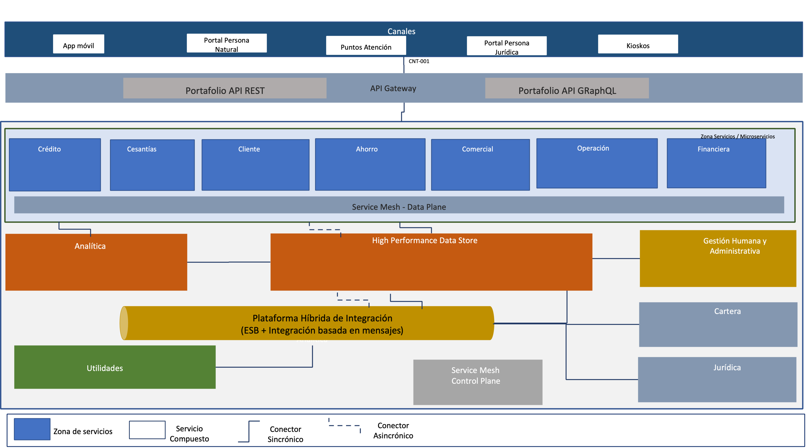

\newpage

| Tema           | $PR12_NOMBRE: **Flujo de trabajo del mantenimiento de la arquitectura de referencia** |
|----------------|----------------------------------------------------------------------|
| Palabras clave | SOA, Arquitectura de referencia, características, dominios, servicios, aplicaciones, datos, |
| Autor          |                                                              |
| Fuente         |                                                              |
| Versión        | **1.$COMMIT** del $FECHA_COMPILACION                         |
| Vínculos       | [Ejecución Plan de Trabajo SOA](onenote:#N001d.sharepoint.com); [Procesos de Negocio FNA](onenote:#N003a.com)|

 

# Diseño y Representación de las Arquitecturas de Referencia 2.0 del FNA
Partimos de la representación de la vista general actual de la arquitectura del FNA, la misma que implica a las problemáticas diagnosticadas en Fase I @eservices1-22 (ver Resumen de problemas diagnosticados, E-Service, Fase I, 2022 en @eservices4-22). Sobre este plano realizaremos luego las propuestas de las vistas funcionales que fungen como arquitecturas de referencia en tanto que proyectan el entendimiento funcional destino útil para enfrentar dichas problemáticas planteadas en @eservices1-22, eservices3-22 y @eservices4-22, y que se resumen en las siguientes.

1. Dependencia de proveedor (OBJ1)
1. Fortaleza SOA de las aplicaciones (OBJ2)
1. Tiempo de mercado (OBJ3)

_Fuente: E-Service, Fase I (2022)._

## Dominio de Servicios y Aplicaciones FNA
### Plano General Actual
El propósito de traer como referencia el plano actual de arquitectura del FNA es recordar dicho esquema  para poderlo comparar con la arquitectura propuesta.

{#fig:arqimage1.png width="12in" height="7in"}

 

### Plano General Objetivo
Presentamos la arquitectura de referencia propuesta dividida en dos niveles de detalle.

#### Nivel de detalle 1: Zonas de la arquitectura
Las zonas o segmentos de la arquitectura presentados en la imagen separan las responsabilidades de cada parte del panorama completo. Estas divisiones, aunque granulares, son importantes para organizar el y hacer avances en los trabajos sin que uno detenga al otro.

{#fig:arqimage1.1.png width="13in" height="7in"}

 

Este nivel de detalle es asimilable como el alcance horizontal de la arquitectura de referencia en la que se informa acerca de los aspectos de la empresa que esta considera. Al contener estos paquetes de trabajo macro expresa una especie de alcance: lo que no esté en estos segmentos no será considerado por el trabajo de arquitectura. En el siguiente nivel de detalle realizaremos una división mayor en donde el objetivo es el mismo, _dividir y organizar el trabajo de arquitectura_.

 

#### Nivel de detalle 2: Áreas de servicios
En este nivel de detalle realizamos la división interna de las zonas de arquitectura presentada anteriormente. Utilizaremos esta división para denotar los servicios SOA que el FNA requiere para el sostenimiento de negocio, la operación y la infraestructura.

{#fig:arqimage2.png width="13in" height="7in"}

Esta división es más táctica que la división de zonas presentada antes. Este vista de áreas de servicios le comunica al equipo de la oficina de arquitectura cuáles serán los dominios enfocados que debe cuidar, los equipos de trabajo que debe considerar, los componentes que debe procurar y el rol de estos, y por supuesto, la comunicación que deben tener estos respecto de sus segmentos contenedores.

 
