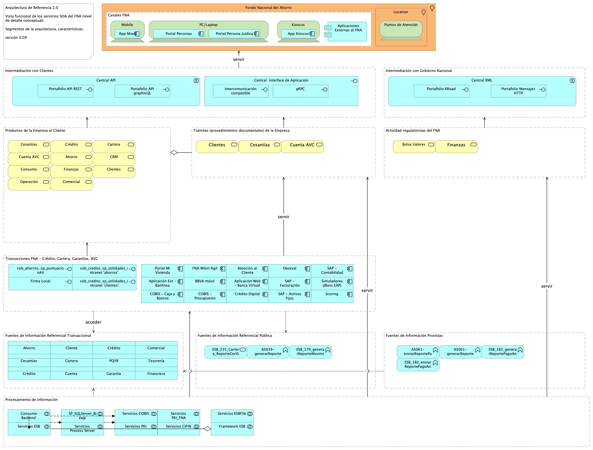

### ARQREF0. Vista Funcional de la Arquitectura de Referencia 2.0. Servicios y Aplicaciones
Presentamos la primera versión del modelo de referencia del dominio de servicios y aplicaciones 2.0 del FNA. El modelo queda representado en la siguiente vista funcional.

{#fig:ARQREF0.png width= height=}

El modelo funcional de la arquitectura de referencia del FNA está organizado en los siguientes segmentos de arquitectura.

#### Segmentos del Modelo Funcional de la Arquitectura de Referencia
1. Canales. Sitios físicos o electrónicos en relación con los clientes.
1. Intermediación con Clientes. Medio físicos o electrónicos de interoperatividad del FNA con los clientes.
1. Intermediación con Gobierno Nacional. Medio físicos o electrónicos de interoperatividad del FNA con entidades del Estado, como la Superintendencia Financiera de Colombia, Min Hacienda y MinTIC.
1. Productos de la Empresa al Cliente. Productos de negocio ofertados, relación con clientes. Son colecciones de servicios que funcionan como una unidad.
1. Trámites (procedimientos documentales) FNA. Procesos relacionados con los productos o clientes del FNA. Basados en documentación física o digital. Ejemplo, trámite de afiliaciones y retiros, el retiro de cesantías, aperturas, etc.
1. Transacciones FNA. Unidades de intercambio de beneficios y registros de Crédito, Cartera, Garantías, Cuenta AVC.
1. Actividad regulatoria del FNA. Procesos de intercambio de funciones regulatorias o sancionatorias e intercambio de información de seguridad debida al cumplimiento exigido por el Gobierno Nacional.
1. Fuentes de Información Referencial Transaccional. Acceso a información requerida por las transacciones del FNA, como listas blancas, seguros, Registraduría.
1. Fuentes de Información Provistas. Exposición de entidades y componentes de datos (reportes, esquemas, archivos...) al Bco. de la República, Ministerios, entre otros.
1. Fuentes de Información Referencial Pública. Acceso a datos de entidades públicas, como Formatos de  Ministerios, Registros de Asobancos, tasas del Bco. de la República.
1. Procesamiento de información. Procesamiento de lotes diario o eventual del FNA, como contabilidad, elaboración de certificados, envío de mensajes electrónicos, descarga de información, emisión de documentos digitales, indexaciones, etc.

 

### Elementos de la Vista Funcional
| Name| Type| Description| Properties
|:--------|:--------|:--------|:--------|
|**Aplicaciones Externas al FNA**|application-component|||
|**Aplicación Ext - Banlínea**|application-component|||
|**Aplicación Web - Banca Virtual**|application-component|||
|**Aplicación Web - Scoring**|application-component||*alcanceSOA:* Fase 1.1 |
|**Aplicación Web - Simuladores (JBoss EAP)**|application-component|||
|**App Kioscos**|application-component|||
|**App Movíl**|application-component|||
|**Atención al Cliente**|application-component|||
|**BBVA móvil**|application-component|||
|**COBIS - Caja y Bancos**|application-component|||
|**COBIS - Presupuesto**|application-component|||
|**Crédito Digital**|application-component|||
|**Deceval**|application-component|||
|**FNA Móvil Ágil**|application-component|||
|**Portal Mi Vivienda**|application-component|||
|**Portal Persona Juídica**|application-component|||
|**Portal Personas**|application-component|||
|**SAP - Activos Fijos**|application-component|||
|**SAP - Contabilidad**|application-component|||
|**SAP - Facturación**|application-component|||
|**Central API**|application-interaction|||
|**Central XML**|application-interaction|||
|**Central  Interface de Aplicación**|application-interface|||
|**Firma Local**|application-interface|||
|**Intercomunicación compatible**|application-interface|||
|**Portafolio API REST**|application-interface|||
|**Portafolio API graphicQL**|application-interface|||
|**Portafolio Mensajes HTTP**|application-interface|||
|**Portafolio XRoad**|application-interface|||
|**cob_ahorros..sp_puntuacionAV**|application-interface|||
|**cob_credito..sp_utilidades_intranet 'ahorros'**|application-interface|||
|**cob_credito..sp_utilidades_intranet 'clientes'**|application-interface|||
|**gRPC**|application-interface|||
|**Ahorro**|business-service|||
|**Bolsa Valores**|business-service|||
|**CRM**|business-service|||
|**Cartera**|business-service|||
|**Cesantías**|business-service|||
|**Cesantías**|business-service|||
|**Clientes**|business-service|||
|**Clientes**|business-service|||
|**Comercial**|business-service|||
|**Consumo**|business-service|||
|**Crédito**|business-service|||
|**Cuenta AVC**|business-service|||
|**Cuenta AVC**|business-service|||
|**Finanzas**|business-service|||
|**Finanzas**|business-service|||
|**Operación**|business-service|||
|**Kioscos**|device|||
|**Mobile**|device|||
|**PC/Laptop**|device|||
|**Puntos de Atención**|device|||
|**Actividad regulatorioas del FNA**|grouping|Procesos de intercambio de funciones regulatorias o sancionatorias e intercambio de información de seguridad debida al cumplimiento exigido por el Gobierno Nacional.||
|**Canales FNA**|grouping|Sitios físicos o electrónicos en relación con los clientes.||
|**Fuentes de Información Provistas**|grouping|Exposición de entidades y componentes de datos (reportes, esquemas, archivos...) al Bco. de la República, Ministerios, entre otros.||
|**Fuentes de Información Referencial Pública**|grouping|Acceso a datos de entidades públicas, como Formatos de  Ministerios, Registros de Asobancos, tasas del Bco. de la República.||
|**Fuentes de Información Referencial Transaccional**|grouping|Acceso a datos de entidades públicas, como Formatos de  Ministerios, Registros de Asobancos, tasas del Bco. de la República.||
|**Intermediación con Clientes**|grouping|Medio físicos o electrónicos de interoperatividad del FNA con los clientes.||
|**Intermediación con Gobierno Nacional**|grouping|Superintendencia Financiera Col. Min Hacienda MinTIC ||
|**Procesamiento de información**|grouping|Procesamiento de lotes diario o eventual del FNA, como contabilidad, elaboración de certificados, envío de mensajes electrónicos, descarga de información, emisión de documentos digitales, indexaciones, etc.||
|**Productos de la Empresa al Cliente**|grouping|Productos de negocio ofertados, relación con clientes. Son colecciones de servicios que funcionan como una unidad.||
|**Transacciones FNA - Crédito, Cartera, Garantías, AVC**|grouping|Unidades de intercambio de beneficios y registros de Crédito, Cartera, Garantías, Cuenta AVC.||
|**Trámites (procedimientos documentales) de la Empresa**|grouping|Procesos relacionados con los productos o clientes del FNA. Basados en documentación física o digital. Ejemplo, trámite de afiliaciones y retiros, el retiro de cesantías, aperturas, etc.||
|**Fondo Nacional del Ahorro**|location|||
|**Location**|location|||

## ARQREF.1.Malla Micross

![Diagram: ARQREF.1.Malla Micross][ARQREF.1.Malla Micross]

[ARQREF.1.Malla Micross]: images/ARQREF.1.Malla%20Micross.png

### Elementos de la Vista
| Name| Type| Description| Properties
|:--------|:--------|:--------|:--------|
|**Ahorro**|application-component|||
|**Ahorro**|application-component|||
|**Ahorro**|application-component|||
|**Ahorro**|application-component|||
|**App Kioscos**|application-component|||
|**App Movíl**|application-component|||
|**Cesantías**|application-component|||
|**Cesantías**|application-component|||
|**Cesantías**|application-component|||
|**Cesantías**|application-component|||
|**Choreography-based saga**|application-component|||
|**Cliente**|application-component|||
|**Cliente**|application-component|||
|**Cliente**|application-component|||
|**Cliente**|application-component|||
|**Comercial**|application-component|||
|**Comercial**|application-component|||
|**Comercial**|application-component|||
|**Comercial**|application-component|||
|**Crédito**|application-component|||
|**Crédito**|application-component|||
|**Crédito**|application-component|||
|**Crédito**|application-component|||
|**Financiera**|application-component|||
|**Financiera**|application-component|||
|**Financiera**|application-component|||
|**Financiera**|application-component|||
|**Operación**|application-component|||
|**Operación**|application-component|||
|**Operación**|application-component|||
|**Operación**|application-component|||
|**Orchestration-based saga**|application-component|||
|**Portal Persona Juídica**|application-component|||
|**Portal Personas**|application-component|||
|**Service Mesh Control Plane**|application-component|||
|**Sidecar Proxy**|application-component|||
|**Sidecar Proxy**|application-component|||
|**Sidecar Proxy**|application-component|||
|**Https**|application-interface|||
|**Https**|application-interface|||
|**gRPC**|application-interface|||
|**gRPC**|application-interface|||
|**API Consumer**|business-actor|||
|**API Providers**|business-actor|||
|**Developer**|business-actor|||
|**Private virtual network API Management**|communication-network|||
|**Private virtual network Kubernates**|communication-network|||
|**Kioscos**|device|||
|**Mobile**|device|||
|**PC/Laptop**|device|||
|** Database per microservice - CQRS**|grouping|||
|**Asynchronous messaging**|grouping|||
|**Canales**|grouping|||
|**Communication & Routing**|grouping|||
|**Control Plane**|grouping|||
|**Data Plane**|grouping|||
|**Data Plane - East West Traffic**|grouping|||
|**Distributed transactions**|grouping|||
|**FNA - Architecture Cloud**|grouping|||
|**Kubernates Cluster - Service orchestration**|grouping|||
|**Management Plane **|grouping|||
|**Managemnet Plane - North south traffic**|grouping|||
|**Monitor & Measure**|grouping|||
|**Security & Protect**|grouping|||
|**Serveless**|grouping|||
|**Service Mesh**|grouping|||
|**User Plane**|grouping|||
|**Fondo Nacional del Ahorro**|location|||
|**Puntos de Atención**|location|||
|**Bastion Host Management**|node|||
|**Private Endpoint per microservices**|path|||
|**Vnet Bastion**|path|||
|**Management Bastion**|system-software|||
|**Internal load balanced**|technology-function|||
|**Message broker**|technology-function|||
|**Topic**|technology-function|||
|** Event Hubs**|technology-service|||
|** Event Hubs**|technology-service|||
|**API Gateway**|technology-service|||
|**API Management**|technology-service|||
|**API Management Service**|technology-service|||
|**Active Directory**|technology-service|||
|**Application Monitor**|technology-service|||
|**Application delivery network**|technology-service|||
|**Developer Portal**|technology-service|||
|**Event Grid**|technology-service|||
|**Infrastructure Monitor**|technology-service|||
|**Kay vault**|technology-service|||
|**Kubernates Service**|technology-service|||
|**Network Security Group**|technology-service|||
|**Platform Monitor**|technology-service|||
|**SQL instance - Microservices operational data **|technology-service|||
|**SQL managed instance - Microservices View data  **|technology-service|||
|**Serveles**|technology-service|||

## ARQREF.2.Datos

![Diagram: ARQREF.2.Datos][ARQREF.2.Datos]

[ARQREF.2.Datos]: images/ARQREF.2.Datos.png

### Elementos de la Vista
| Name| Type| Description| Properties
|:--------|:--------|:--------|:--------|
|**Ahorro**|application-component|||
|**Ahorro (copy)**|application-component|||
|**Application WEB/ Mobile**|application-component|||
|**Cesantías**|application-component|||
|**Cesantías (copy)**|application-component|||
|**Cliente**|application-component|||
|**Cliente (copy)**|application-component|||
|**Comercial**|application-component|||
|**Comercial (copy)**|application-component|||
|**Crédito**|application-component|||
|**Crédito (copy)**|application-component|||
|**Financiera**|application-component|||
|**Financiera (copy)**|application-component|||
|**Master Data**|application-component|||
|**Operación**|application-component|||
|**Docs**|artifact|||
|**Business Data Owner**|business-actor|||
|**Business Process Owner**|business-actor|||
|**Data Stewardship**|business-actor|||
|**FNA User**|business-actor|||
|**Governance Stewardship**|business-actor|||
|**Technical Data Stewardship**|business-actor|||
|**Administración de Cuentas y Pagos Cesantías**|business-process|||
|**Proceso de Aportes de Cesantías**|business-process|||
|**Procesos Gestión de Crédito Educativo**|business-process|||
|**Procesos Gestión de Crédito Hipotecario**|business-process|||
|**Procesos Gestión de crédito Constructor**|business-process|||
|**Cartera**|data-object|||
|**Cesantias**|data-object|||
|**Cliente**|data-object|||
|**Crédito**|data-object|||
|**Cuenta**|data-object|||
|**Garantía**|data-object|||
|**PQYR**|data-object|||
|**Tesorería**|data-object|||
|** Database per microservice - CQRS**|grouping|||
|**Business Users**|grouping|||
|**Data Product**|grouping|||
|**Data Product**|grouping|||
|**Data Product**|grouping|||
|**Data Product**|grouping|||
|**Data Product**|grouping|||
|**Data Product**|grouping|||
|**Data Product**|grouping|||
|**Data Product**|grouping|||
|**Data landing zone - Self-serve data**|grouping|||
|**Data management Zone - Data Governance**|grouping|||
|**Domain Data**|grouping|||
|**Domain Data**|grouping|||
|**Domain Data**|grouping|||
|**Domain Data**|grouping|||
|**Domain Data**|grouping|||
|**Domain Data**|grouping|||
|**Domain Data**|grouping|||
|**Domain Data**|grouping|||
|**Enrich - BI & Data Science**|grouping|||
|**FNA - Architecture**|grouping|||
|**FNA - Data sources**|grouping|||
|**FNA Data Mesh**|grouping|||
|**FNA Mission Processes **|grouping|||
|**Ingest and prepare data**|grouping|||
|**Orchestrate - Data Pipeline**|grouping|||
|**Platform service**|grouping|||
|**Polyglot storage**|grouping|||
|**Process Data **|grouping|||
|**Serve Data **|grouping|||
|**Store Data **|grouping|||
|**Transform and prepare**|grouping|||
|**Junction**|junction|||
|**DB2**|system-software|||
|**ECM**|system-software|||
|**Oracle**|system-software|||
|**SAP**|system-software|||
|**SQL Server**|system-software|||
|**Active Directory**|technology-service|||
|**Analytics engine**|technology-service|||
|**Azure Policy**|technology-service|||
|**Cognitive services**|technology-service|||
|**Cosmos DB**|technology-service|||
|**Data Integration**|technology-service|||
|**Data Lake**|technology-service|||
|**Data Process**|technology-service|||
|**Data Share**|technology-service|||
|**Enterprise analytics service**|technology-service|||
|**Key Vault**|technology-service|||
|**Machine learning**|technology-service|||
|**Monitor**|technology-service|||
|**Profisee - MDM**|technology-service|||
|**Purview - Data Catalog **|technology-service|||
|**SQL managed instance - Microservices View data  **|technology-service|||
|**SQL managed instance - Microservices operational data **|technology-service|||
|**Security center**|technology-service|||
|**Semantic Models**|technology-service|||

## ARQREF.3.Entrega

![Diagram: ARQREF.3.Entrega][ARQREF.3.Entrega]

[ARQREF.3.Entrega]: images/ARQREF.3.Entrega.png

### Elementos de la Vista
| Name| Type| Description| Properties
|:--------|:--------|:--------|:--------|
|**Azure Cli**|application-component|||
|**Azure Portal**|application-component|||
|**Azure Portal**|application-component|||
|**Azure PowerShell**|application-component|||
|**Browser**|application-component|||
|**Browser**|application-component|||
|**Client**|application-component|||
|**DevOps Variables**|artifact|||
|**Files**|artifact|||
|**Library**|artifact|||
|**yaml pipelines**|artifact|||
|**Admin DevOps**|business-role|||
|**Analysts**|business-role|||
|**Analysts**|business-role|||
|**Dev Team**|business-role|||
|**Developer**|business-role|||
|**Tester**|business-role|||
|**Tester**|business-role|||
|**Project**|contract|||
|**Azure cloud **|location|||
|**Environment**|node|||
|**Laptop/desktop**|node|||
|**Laptop/desktop**|node|||
|**Laptop/desktop**|node|||
|**Git**|system-software|||
|**Clone**|technology-event|||
|**Pull**|technology-event|||
|**Push**|technology-event|||
|**Branches**|technology-function|||
|**Commits**|technology-function|||
|**Dev**|technology-function|||
|**Master**|technology-function|||
|**Pull request**|technology-function|||
|**Pushes**|technology-function|||
|**QA**|technology-function|||
|**Tags**|technology-function|||
|**CD**|technology-process|||
|**CI**|technology-process|||
|**Azure Active Directory**|technology-service|||
|**Azure Artifacts**|technology-service|||
|**Azure Boards**|technology-service|||
|**Azure Container Registry (non-production)**|technology-service|||
|**Azure Container Registry (production)**|technology-service|||
|**Azure Overview**|technology-service|||
|**Azure Pipelines**|technology-service|||
|**Azure RBAC Roles**|technology-service|||
|**Azure Repos**|technology-service|||
|**Azure Resource Management**|technology-service|||
|**Azure Resource Provider**|technology-service|||
|**Backlogs**|technology-service|||
|**Boards**|technology-service|||
|**Build Pipeline**|technology-service|||
|**Dashboards**|technology-service|||
|**Delivery plans**|technology-service|||
|**Deployments groups**|technology-service|||
|**FNA Azure Projects**|technology-service|||
|**FNA Azure Suscription**|technology-service|||
|**FNA Organization**|technology-service|||
|**Financial commitment limits**|technology-service|||
|**Progress report**|technology-service|||
|**Queries**|technology-service|||
|**Releases**|technology-service|||
|**Resource Policies**|technology-service|||
|**Resource limits**|technology-service|||
|**Resources group**|technology-service|||
|**Runs**|technology-service|||
|**Sprints**|technology-service|||
|**Summary **|technology-service|||
|**Task groups**|technology-service|||
|**Tenant**|technology-service|||
|**Test Plants**|technology-service|||
|**Test Plants**|technology-service|||
|**Wiki**|technology-service|||
|**Work items**|technology-service|||

## ARQREF.4.FNA

![Diagram: ARQREF.4.FNA][ARQREF.4.FNA]

[ARQREF.4.FNA]: images/ARQREF.4.FNA.png

### Elementos de la Vista
| Name| Type| Description| Properties
|:--------|:--------|:--------|:--------|
|**Ahorro**|application-component|||
|**Ahorro**|application-component|||
|**Ahorro**|application-component|||
|**Aplicaciones Externas al FNA**|application-component|||
|**App Kioscos**|application-component|||
|**App Movíl**|application-component|||
|**Cesantías**|application-component|||
|**Cesantías**|application-component|||
|**Cesantías**|application-component|||
|**Cliente**|application-component|||
|**Cliente**|application-component|||
|**Cliente**|application-component|||
|**Comercial**|application-component|||
|**Comercial**|application-component|||
|**Comercial**|application-component|||
|**Crédito**|application-component|||
|**Crédito**|application-component|||
|**Crédito**|application-component|||
|**Financiera**|application-component|||
|**Financiera**|application-component|||
|**Financiera**|application-component|||
|**Operación**|application-component|||
|**Operación**|application-component|||
|**Operación**|application-component|||
|**Portal Persona Juídica**|application-component|||
|**Portal Personas**|application-component|||
|**Service Mesh Control Plane**|application-component|||
|**Files**|artifact|||
|**Library**|artifact|||
|**Private virtual network API Management**|communication-network|||
|**Private virtual network Kubernates**|communication-network|||
|**Private virtual network database**|communication-network|||
|**Ahorro**|data-object|||
|**Cartera**|data-object|||
|**Cesantias**|data-object|||
|**Cliente**|data-object|||
|**Comercial**|data-object|||
|**Crédito**|data-object|||
|**Financiera**|data-object|||
|**Operación**|data-object|||
|**Kioscos**|device|||
|**Mobile**|device|||
|**PC/Laptop**|device|||
|**Analytics**|grouping|||
|**Asynchronous messaging**|grouping|||
|**Canales FNA**|grouping|Sitios físicos o electrónicos en relación con los clientes.||
|**Collaborative work**|grouping|||
|**Communication & Routing**|grouping|||
|**Control Plane**|grouping|||
|**Data Plane**|grouping|||
|**Data Product**|grouping|||
|**Data Product**|grouping|||
|**Data Product**|grouping|||
|**Data Product**|grouping|||
|**Data Product**|grouping|||
|**Data Product**|grouping|||
|**Data Product**|grouping|||
|**Data Product**|grouping|||
|**Data landing zone - Self-serve data**|grouping|||
|**Database  Layer**|grouping|||
|**Domain Data**|grouping|||
|**Domain Data**|grouping|||
|**Domain Data**|grouping|||
|**Domain Data**|grouping|||
|**Domain Data**|grouping|||
|**Domain Data**|grouping|||
|**Domain Data**|grouping|||
|**Domain Data**|grouping|||
|**Enrich - BI & Data Science**|grouping|||
|**FNA - Computación de la Empresa**|grouping|||
|**Ingest and prepare data**|grouping|||
|**Kubernates Cluster - Service orchestration**|grouping|||
|**Management Plane **|grouping|||
|**Managemnet Plane - North south traffic**|grouping|||
|**Monitor & Measure**|grouping|||
|**Orchestrate - Data Pipeline**|grouping|||
|**Polyglot storage**|grouping|||
|**Process Data **|grouping|||
|**Security & Protect**|grouping|||
|**Serve Data **|grouping|||
|**Serveless**|grouping|||
|**Service Mesh**|grouping|||
|**Storage Layer**|grouping|||
|**Store Data **|grouping|||
|**Transform and prepare**|grouping|||
|**User Plane**|grouping|||
|**VM Database Server**|grouping|||
|**Junction**|junction|||
|**Fondo Nacional del Ahorro**|location|||
|**Environment**|node|||
|**VM DB2 server**|node|||
|**VM Oracle server**|node|||
|**VM SAP server**|node|||
|**Private Endpoint per microservices**|path|||
|**Branches**|technology-function|||
|**Commits**|technology-function|||
|**Message broker**|technology-function|||
|**Pull request**|technology-function|||
|**Pushes**|technology-function|||
|**Tags**|technology-function|||
|**Topic**|technology-function|||
|** Event Hubs**|technology-service|||
|**API Gateway**|technology-service|||
|**API Management**|technology-service|||
|**API Management Service**|technology-service|||
|**Active Directory**|technology-service|||
|**Analytics engine**|technology-service|||
|**Application Monitor**|technology-service|||
|**Application delivery network**|technology-service|||
|**Azure Artifacts**|technology-service|||
|**Azure Boards**|technology-service|||
|**Azure Overview**|technology-service|||
|**Azure Pipelines**|technology-service|||
|**Azure Repos**|technology-service|||
|**Backlogs**|technology-service|||
|**Boards**|technology-service|||
|**Build Pipeline**|technology-service|||
|**Chache for Redis service**|technology-service|||
|**Cognitive services**|technology-service|||
|**Container Registry**|technology-service|||
|**Content delivery network**|technology-service|||
|**Dashboards**|technology-service|||
|**Data Integration**|technology-service|||
|**Data Lake**|technology-service|||
|**Data Lake Storage**|technology-service|||
|**Data Process**|technology-service|||
|**Data Share**|technology-service|||
|**Delivery plans**|technology-service|||
|**Deployments groups**|technology-service|||
|**Developer Portal**|technology-service|||
|**Enterprise analytics service**|technology-service|||
|**Event Grid**|technology-service|||
|**FNA Azure Projects**|technology-service|||
|**FNA Organization**|technology-service|||
|**File Storage**|technology-service|||
|**Infrastructure Monitor**|technology-service|||
|**Kay vault**|technology-service|||
|**Kubernates Service**|technology-service|||
|**MDM**|technology-service|||
|**Machine learning**|technology-service|||
|**Network Security Group**|technology-service|||
|**NoSQL DB**|technology-service|||
|**Platform Monitor**|technology-service|||
|**Progress report**|technology-service|||
|**Queries**|technology-service|||
|**Queue Storage**|technology-service|||
|**Releases**|technology-service|||
|**Runs**|technology-service|||
|**SQL instance - Microservices operational data **|technology-service|||
|**Semantic Reports & BI**|technology-service|||
|**Serveles**|technology-service|||
|**Sprints**|technology-service|||
|**Storage Service**|technology-service|||
|**Summary **|technology-service|||
|**Table Storage**|technology-service|||
|**Task groups**|technology-service|||
|**Test Plants**|technology-service|||
|**Test Plants**|technology-service|||
|**Wiki**|technology-service|||
|**Work items**|technology-service|||
