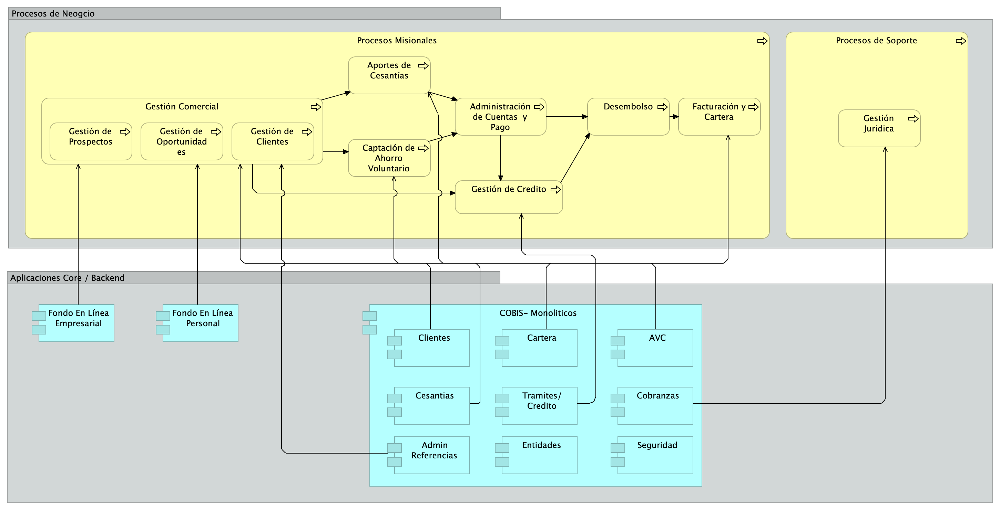

\newpage

| Tema           | $PR12_NOMBRE: **Consideraciones para implementar la arquitectura de referencia** |
|----------------|----------------------------------------------------------------------|
| Palabras clave | SOA, Arquitectura de referencia, características, implementación, hoja de ruta,  |
| Autor          |                                                              |
| Fuente         |                                                              |
| Versión        | **1.$COMMIT** del $FECHA_COMPILACION                         |
| Vínculos       | [Ejecución Plan de Trabajo SOA](onenote:#N001d.sharepoint.com); [Procesos de Negocio FNA](onenote:#N003a.com)|

 

# Consideraciones de Diseño de las Arquitecturas de Referencia del FNA
En esta sección ampliaremos las consideraciones dadas al FNA para la creación y mantenimiento de arquitecturas de referencia. En este caso daremos información que advierta las incorreciones de diseño de las que debe alejarse la empresa. Estos diseños problemáticos que describiremos aquí deben ser usadas para vigilar cada cambio en las arquitecturas del FNA, así como en las evaluaciones, y comparar estos cambios contra estas advertencias para luego determinar si los diseños (y soluciones e implementaciones) requieren acciones de remediación.

## Diseños Centrados en el Proveedor
El principal diseño del que debe alejarse el FNA es todo aquel el que aumente la dependencia de proveedor. Es decir, _los diseños centrados en el proveedor son los problemáticos_. Ejemplo de esto, y así diagnosticado en Fase I de esta consultoría, es el ERP Cobis. Este reune más de nueve módulos de software, la mayoría relacionados con la misión del Fondo Nacional. Es por tanto un diseño problemático que el ERP esté en el centro de la empresa y tender relaciones directas a este desde otros puntos de la empresa.

    Nota: en este contexto, nos referimos a una perspectica tecnológica de la empresa.

En el diagrama siguiente presentamos esta consideración de forma visual en la que queremos se aprecie el problema de tender relaciones directas desde los procesos de negocio a un proveedor tecnológico, COBIS.

{#fig: width="6in" height="3in"}

En la imagen: las relaciones directas que los procesos de negocio puedan tener con un proveedor son la causa de dos problemas: el acomplamiento al proveedor, lo que a su vez contribuye al problema de diseño que hemos llamado dependencia al proveedor.

Este mismo problema se presenta de forma indirecta cuando existe un intermediario entre las partes. Siguiendo con el ejemplo ilustrado arriba, cuando existe un intermediario entre los procesos de negocio y el proveedor, sea un bus empresarial, un integrador, proxie, o algún intermediario cualquiera de sus formas, existe el mismo problema que denunciamos en este diseño centrado en el proveedor. La presencia de un intermediario no elimina este problema, solo lo esconde, y por tanto, lo acrecienta.

    Nota: este mismo problema se presenta de forma indirecta cuando existe un intermediario entre las partes. La presencia de un intermediario no elimina este problema, solo lo esconde, y por tanto, lo acrecienta.

 
