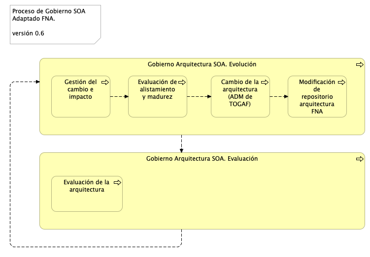
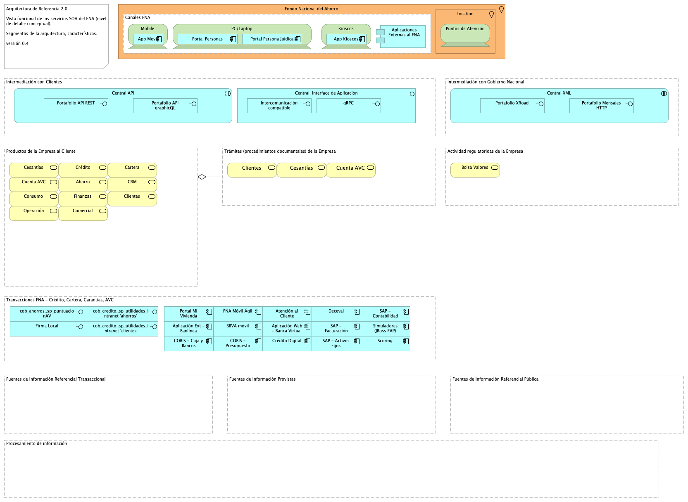
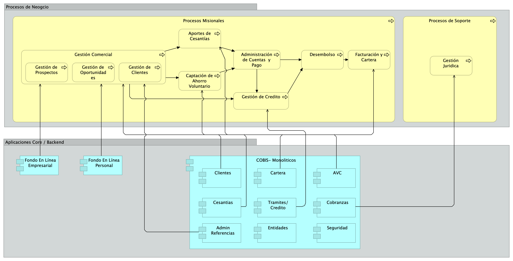
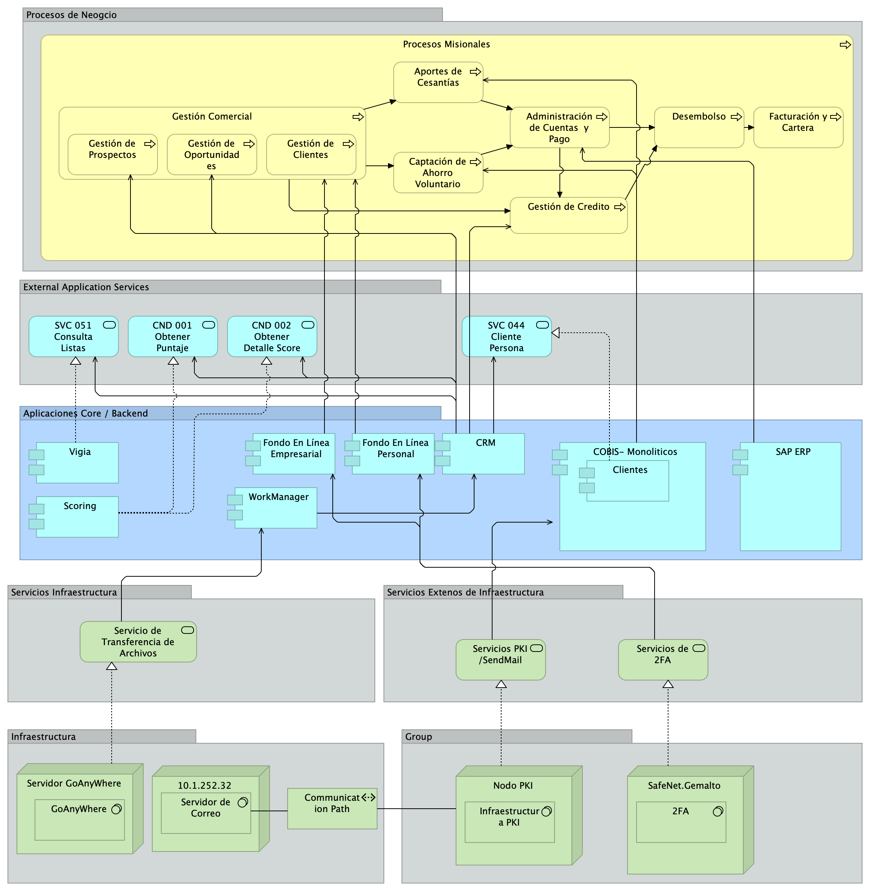

title: E-Service Etapa 2. Arquitectura de Referencia SOA 2.0 del FNA
geometry:
  - top=1in
  - bottom=1in
fignos-cleveref: True
fignos-plus-name: Fig.
fignos-caption-name: Imagen
tablenos-caption-name: Tabla
...

<small><em>Los productos de esta etapa ([Web](https://hwong23.github.io/fna-dd-f2-pry2-e1/v/59b46cb57c3760386b1a6a16fa40a823d5132854/))
están basados en el resultado de la consultoría "Arquitectura E-Service",
[Sharepoint STEF@59b46cb](https://stefaninilatam.sharepoint.com/:f:/r/sites/PROYECTOARQUITECTURAE-SERVICEFNA/Documentos%20compartidos/General/Repositorio%20SOA/Procesos%20Fase%20II/181-2020.%20E-SERV.%20Fase%202-ETAPA%200.%20docx?csf=1&web=1&e=BiNcBP)
del August 9, 2023.
</em></small>

|    **Versión** del producto 1.59b46cb de 09 Aug 2023

 

## Autores

+ **Harry Wong, ing.**
   
    · {.inline_icon width=16 height=16}
    [e_hwong](https://github.com/e_hwong)
     
  <small>
     Arquitecto SOA, Stefanini
  </small>

+ **Wilson Morales, ing.**
   
    · {.inline_icon width=16 height=16}
    [wmorales](https://github.com/wmorales)
     
  <small>
     Software, Aplicaciones
  </small>

+ **Sergio Andres Castro Hernandez, ing.**
   
    · {.inline_icon width=16 height=16}
    [scastro](https://github.com/scastro)
     
  <small>
     SOA, Arquitectura
  </small>

+ **Viviana M. Martinez, ing.**
   
    · {.inline_icon width=16 height=16}
    [vmmartinez](https://github.com/vmmartinez)
     
  <small>
     Analista, Proyectos
  </small>

::: {#correspondence}
✉ — Enviar mensajes a Harry Wong, ing. \<e_hwong@stefanini.com\>.

:::

 

## Objetivo del Documento
Entrega de los productos de la Etapa 1, PR11. Detalle de los recursos, herramientas, roles, responsabilidades y participantes y PR12. Diseño detallado y vistas funcional, despliegue, información, integración y tecnología​, del proyecto Arquitectura de Referencia SOA 2.0 del FNA, flujos de trabajo y personas que ejercitan y conforman (cumplen) con el gobierno SOA del FNA a desplegar a cargo de la oficina de arquitectura.

##  Control de Cambios {.page_break_before}
| Tema           | PRY02 Arquitectura de Referencia SOA 2.0 del FNA      |
|----------------|----------------------------|
| Palabras clave | SOA, E-Service, FNA, Análisis de brecha, GAP, Comparativa              |
| Autor          |                            |
| Fuente         |                            |
| Versión        | 1.59b46cb del 09 Aug 2023 |
| Vínculos       | [N003a Vista Segmento SOA FNA](N03a%a20Vsta%20aSegenta%20SOA%20FNA.md) |

 

 

## Contenidos
\toc

---
prnombre: "Detalle de los recursos, herramientas, roles, responsabilidades y participantes"
...

\newpage

>    E-Service. Fase II
> 
>    PRY02. Arquitectura de Referencia SOA 2.0 del FNA. Contenido de los Productos Contractuales
> 
>    Contrato 1812020
> 
>    FNA, Stefanini
> 
>    09 Aug 2023
>
>    **Versión** 1.59b46cb

 

# Producto 11: PR11. Detalle de los recursos, herramientas, roles, responsabilidades y participantes
La arquitectura referencia SOA 2.0 del FNA, objeto de este proyecto, la forman las estructuras e integraciones de productos y servicios SOA. Esta es el soporte de decisiones de la Vicepresidencia de tecnología del FNA, tanto de desarrollo, mejoras a las aplicaciones y herramientas de software del FNA, y para la adquisición y migración de tecnologías específicas. 

Este producto define los elementos mínimos para garantizar la vigencia y ejercicio de la arquitectura de referencia SOA, objeto de este proyecto, y línea base para dirigir el diseño, desarrollo y entrega de los servicios SOA y tecnologías del FNA.

 

## Justificación
En el proyecto anterior, Gobierno SOA del FNA (Proyecto 1, E-Service, Fase II) se establecen objetivos de gobierno: Mantenimiento de Relación Negocio - Arquitectura (G-OBJG1), y Seguimiento a cambios en la arquitectura de referencia (G-OBJS3). Esto demanda mantenibilidad de la arquitectura de referencia, que a su vez esta es responsable de 1) dirigir y evolucionar las soluciones tecnológica del FNA. Demanda también 2) orientar el diseño de estas arquitecturas, y 3) ser el instrumento de control con el cual hacer cumplir los principios de diseño de servicios SOA del FNA y del Manual de Gobierno. Para lograr estos objetivos y responsabilidades exigidas por gobierno, es necesario que desde este proyecto, PRY02. Arquitectura de Referencia SOA 2.0 del FNA, se detallen los recursos, herramientas, roles, responsabilidades y participantes que garanticen que los procesos y operaciones de gestión, cambio y vigencia de la arquitectura de referencia sean puestos en marcha cuando el FNA así lo considere.

## Contenidos
1. Flujo de trabajo del mantenimiento de la arquitectura de referencia (Oficina de Arquitectura del FNA)
1. Principios y operaciones de mantenimiento de la arquitectura de referencia (Oficina de Arquitectura del FNA)
1. Matriz de responsabilidades del mantenimiento de la arquitectura de referencia (Oficina de Arquitectura del FNA)

 

## Criterios de Aceptación
* Entendimiento de las operaciones y mantenibilidad de la arquitectura de referencia SOA 2.0 del FNA
* Matriz de roles y procedimientos encargados de mantenibilidad de la arquitectura de referencia SOA 2.0

 

## Modelo de Implementación del PRY02
{#fig: width=}

_Fuente: Elaboración propia._

 

\newpage

| Tema           | Detalle de los recursos, herramientas, roles, responsabilidades y participantes: **Flujo de trabajo del mantenimiento de la arquitectura de referencia** |
|----------------|----------------------------------------------------------------------|
| Palabras clave | SOA, Arquitectura de referencia, Flujo de trabajo, tareas, actividades, roles, acciones                    |
| Autor          |                                                              |
| Fuente         |                                                              |
| Versión        | **1.59b46cb** del 09 Aug 2023                       |
| Vínculos       | [Ejecución Plan de Trabajo SOA](onenote:#N001d.sharepoint.com); [Procesos de Negocio FNA](onenote:#N003a.com)|

 

# Definición de Arquitectura de Referencias del FNA
Definiremos lo que en el contexto de este trabajo significa el concepto de arquitectura de referencia SOA 2.0 del FNA, y para qué sirve.

En lo general, la arquitectura de referencia del FNA (ARF, en adelante), objeto de este proyecto, es un instrumento para la toma de decisiones de cambios, similar a un mapa, tanto en la organización, funcionamiento, modernización y optimización de los sistemas de información del FNA o de componentes primordiales de estos. _Esta último parte es importante: en este contexto, la arquitectura de referencia, distinta de un diseño de solución, no opera sobre artefactos ejecutables específicos de solución_ (bloques de solución específicos o CBB de TOGAF), sino que lo hace sobre componentes misionales y funcionales del FNA sustentados con _decisiones de arquitectura_ rectoras de la implementación.

    Importante. La arquitectura de referencia, distinta de un diseño de solución, no opera en artefactos ejecutables específicos_, sino que opera sobre componentes funcionales del FNA y se materializa mediante decisiones de arquitectura anteriores a la implementación.

Las arquitecturas de referencia del FNA (ARF) están formadas por componentes y estructuras funcionales y tecnológicas, integraciones y colaboración de datos y productos, y de servicios SOA a nivel de negocio. En virtud de esto, sirve de instrumento para el soporte de decisiones futuras de la Vicepresidencia de Tecnología del FNA, tanto en la línea de desarrollo o mejoras a las aplicaciones y herramientas de software del FNA, y para la adquisición y migración de tecnologías específicas.

En lo particular, este instrumento tecnológico se vuelve necesario para el FNA para dirigir los cambios de los servicios SOA del FNA hacia diseños y tecnologías del plano de referencia (dominio) que aplique, ejemplo, microservicios, REST, API, infraestructura, Nube, etc., y favorecer la adopción del _estilo de arquitectura orientado a eventos_ resultante de los diagnósticos anteriores (@eservices1-22 y @eservices3-22) para atender las funcionalidades y necesidades de negocio, con prioridad en las de la vicepresidencia de operaciones y de crédito FNA.

En este producto del proyecto definiremos la línea base de estas arquitecturas de referencia del FNA, a las que podemos llamar Arquitectura de Referencia SOA 2.0 del Fondo Nacional del Ahorro.

 

# Separación de Conceptos y Procesos de Arquitectura e Ingeniería
Iniciamos por separar los conceptos pertinentes a la arquitectura y a la ingeniería para luego desarrollar con claridad y mayor libertad los temas de la primera, como son el flujo de trabajo de mantenimiento de arquitecturas.

Definimos en este proyecto a la gestión de las arquitecturas de referencia del FNA como un enfoque centrado en modelos para desarrollar, mantener y entregar soluciones de arquitectura independiente de otros métodos y productos de la ingeniería de sistemas. Distinto a esta última, el foco de la arquitectura no es la construcción, _si no que esta se enfoca más en el conjunto integrado de propiedades sistémicas que en los aportes de las ingenierías individuales_, que son las que implementan y despliegan los artefactos ejecutables.

    Importante. La distinción de la arquitectura (respecto de la ingeniería), en este contexto, es el foco en integrar propiedades de los sistemas, y la optimización de estos, entre todas las contribuciones de ingenierías independientes, como datos, infraestructura, redes, entre otras.

Sin perjuicio de esta separación que establecemos para el trabajo de este proyecto, la gestión y desarrollo de arquitecturas de referencias (en adelante arquitectura de referencia FNA, que incluye en el alcance de este proyecto a servicios SOA, herramientas de software y componentes), _por estar inmersa en la disciplina de ingeniería de sistemas, aunque independiente_, hereda muchas de las formas de trabajo de esta última, además de los cuidados de calidad que a esta se le exigen. Por ejemplo, desde la perspectiva de sistemas en la que se encuentra inmersa el desarrollo de arquitecturas del FNA, esta hace foco en las propiedades sistémicas (o características de calidad no funcional), entre las que se incluyen a la funcionalidad, estructura, rendimiento, seguridad, confiabilidad.

Esta necesaria separación de conceptos facilita el operar las arquitecturas, y en particular objetivo de este proyecto, las arquitecturas de referencia FNA con mayor libertad y profundidad, lo cual a su vez le reportará a la oficina de arquitectura del FNA las eficiencias específicas de esta disciplina.

{#fig:procesosarq.png width=}

 

# Flujo de Trabajo del FNA para la Creación y Mantenimiento de la Arquitectura de Referencia
Hemos diseñado un flujo de trabajo con características habilitantes para su uso dentro del FNA. Una de estas es la articulación con los otros flujos de trabajo producidos por esta consultoría, E-Service, Fase I y II. Tal es el caso del FLUJO01 y FLUJO02 pertenecientes a la oficina de arquitectura del FNA (ver [Flujos de trabajo FNA](../../fna-dd-f2-e1/content/02n.2b.flujooficarq.md)).

Otra de las características que personalizan a este flujo, (código FLARQ03), de creación y mantenimiento de arquitecturas de referencia del FNA, es que este hace énfasis en la verificación de las arquitecturas, además de su centro que es la especificación de los requerimientos de las arquitecturas de referencia (primera actividad del flujo); característica aquella dirigida a enfrentar las problemáticas que evitan que la arquitectura se vuelva irrelevante dentro de la empresa.

El diagrama siguiente presenta una versión resumida del flujo de trabajo FLARQ03, Creación y Mantenimiento de la Arquitectura de Referencia.

{#fig: width=}

_Fuente: elaboración propia._

La estructura interna del este flujo de trabajo personalizado atiende a tres pilares requeridos para el caso del FNA. La parte inferior de este flujo: Especificación de las arquitecturas (nivel detalle 100); Ingeniería, o entrega a diseños de nivel de detalle 300; y la tercera parte que se encarga de la verificación de los dos anteriores: que las especificaciones coincidan con los diseños de solución.

Presentamos una ilustración con las partes de la estructura interna a la que responde el flujo de trabajo del mantenimiento de las arquitecturas FNA.

{#fig: width=}

_Fuente: elaboración propia._

Finalmente, los requerimientos que se pueden solicitar a la arquitectura de referencia y para los que funciona mejor el flujo de trabajo FLARQ03 descrito son los siguientes: 

* transiciones
* migraciones
* interfaces
* reformas
* controles
* integración
* análisis
* simplificación (también conocido como aumento de la confiabilidad)

**Nota**: otros tipos de requerimientos se pueden agregar sin perjuicio de estos.

 

## (Paso 1) Especificaciones de Arquitectura Referencia
Describiremos el paso 1 del flujo de trabajo presentado en esta sección. La importancia de este frente a los otros es que es una actividad nueva para los involucrados en la oficina de arquitectura, motivo por el cual hacemos la descripción únicamente a este paso.

1. (una vez cuente con la información de entrada, es decir, las brechas que el actor de negocio provee) Identificar las declaraciones generales y las **relaciones fundamentales**.
     Ejemplo:
     • La aplicación 1, ejemplo, debe estar asignada a un servicio _Nombre/Id. del Servicio_ que la ejecuta.
     • La aplicación 1, debe estar asignada a los componentes _Nombre/Id. del Componente_ que la soportan.
     • La aplicación 1, responde a los eventos de negocio _Nombre/Id. del Evento_.

2. Elaborar el metamodelo textual focalizado basado en las declaraciones anteriores
     Ejemplo:
     • La aplicación 1 está asignada al servicio _Nombre/Id. del Servicio_.
     • La aplicación 1 se compone de _Nombre/Id. del Componente_.
     • La aplicación 1 responde al evento _Nombre/Id. del Evento_.

3. Elaborar el diagrama por cada declaración del metamodelo (por cada relación)

## Procedimientos Internos para la Gestión de las Arquitecturas de Referencia FNA
El flujo de trabajo propuesto arriba facilita la ejecución de procedimientos todos necesarios para dar cumplimiento a su objetivo central sobre las arquitecturas de referencia del FNA: crea y mantenerlas.

Estos procedimientos facilitadores son:

1. Gestión del trabajo de arquitectura
1. Medición del progreso del trabajo
1. Exploración de riesgos técnicos de las arquitecturas de referencia
1. Descomposición del trabajo
1. Organización de elementos y modelamiento
1. Emisión de transiciones de las arquitecturas de referencia *

  

* Este último de vital importancia para la gestión de la implementación de las arquitecturas de solución derivadas de las referencias del FNA.

 

### Gestión del Trabajo de Arquitectura
Bajo el principio de mantener simple los procesos y procedimientos para que puedan ser llevados a la práctica, definimos la gestión de los trabajos requeridos para mantener a las arquitecturas de referencia FNA como un pila (conjunto) priorizada de ítems de trabajo de arquitectura (ITA, en adelante) que contiene y comunica únicamente el trabajo por realizar. Esta pila de trabajo, que es distinto a un plan de trabajo tradicional, funciona como una previa de este. En nuestro contexto, el plan de trabajo tradicional toma como base a la pila de trabajo y para dividirse en otros dos, que son el plan de iteración y el plan de liberaciones.

Un ITA (ítem de trabajo de arquitectura) puede ser cualquiera de los requerimientos de trabajo para los que el flujo FLARQ03 está optimizado, esto es, transiciones, interfaces, reformas, controles, integraciones, análisis o simplificaciones. Otros tipos de requerimientos se pueden agregar al flujo de trabajo sin perjuicio de estos.

 

### Medición del Progreso del Trabajo
El trabajo de las arquitecturas de referencia del FNA debe ser medido para que sea a la vez mejorado. En esta sección nos referimos puntualmente a la mejora del trabajo de arquitectura entendido como el (primero) desarrollo y gestión de las arquitecturas de transición: cambio estable de una versión a otra; y (segundo) a la transición del diseño a la implementación. Para conseguir esta mejora y aprovechar oportunidades es necesario desarrollar métricas para estos dos aspectos del trabajo de arquitectura que den indicios de cambiar las actividades y el cómo las estemos haciendo.

Un aspecto de control que es clave para la fijación de las métricas de mejoramiento sobre estos dos trabajos de arquitectura declarados aquí es la correlación con los objetivos. Las métricas que se definan no son objetivos, pero deben estar correlacionadas con estos.

Proveemos algunos ejemplos de métricas que se correlacionen con los objetivos de los trabajos de arquitectura arriba mencionados.

| Objetivo       | Métrica                          | Observación               |
|----------------|----------------------------------|---------------------------|
| Tamaño de la arquitectura | Cantidad de componentes y relaciones | La cantidad de componentes y de relaciones puede dar una idea de la complejidad, aunque no siempre es una implica a esta. |
| Productividad  | Velocidad de transición | La velocidad por sí sola no incorpora a la complejidad. Esta métrica debe ser interpretada en conjunto con otras que sí traten a la complejidad para contar con una interpretación ponderada de la productividad. |
| Eficiencia     | Costo por transición | Puede haber problemas de subjetividad cuando la dificultad para contabilizar los costos, o sopesarlos contra los beneficios, es alta. |
| Calidad de transición | Densidad de desviaciones | Puede que sea complejo determinar cómo encontrar estas desviaciones del diseño y la implementación y la frecuencia con la que se los busca. Según la manera como se concrete, esta métrica puede afectar a la de eficiencia. |

Table: Ejemplo de métricas para el trabajo de arquitectura: transición de versión y transición de diseños. {#tbl:metricas-id}

 

\newpage

| Tema           | Detalle de los recursos, herramientas, roles, responsabilidades y participantes: **Flujo de trabajo del mantenimiento de la arquitectura de referencia** |
|----------------|----------------------------------------------------------------------|
| Palabras clave | SOA, Arquitectura de referencia, Flujo de trabajo, tareas, actividades, roles, acciones                    |
| Autor          |                                                              |
| Fuente         |                                                              |
| Versión        | **1.59b46cb** del 09 Aug 2023                       |
| Vínculos       | [Ejecución Plan de Trabajo SOA](onenote:#N001d.sharepoint.com); [Procesos de Negocio FNA](onenote:#N003a.com)|

 

# Principios de Mantenimiento de la Arquitectura de Referencia 2.0 del FNA
En este contexto vamos a definir al agilismo como un método (distinto a disciplina, o proceso) para conseguir la calidad de los productos de arquitectura, no para acelerar desmesuradamente las actividades de la oficina [ver Procesos de Arquitectura]. Desde esta definición reforzaremos el flujo de trabajo del mantenimiento de una arquitectura (descrito en [Flujo de Trabajo del FNA para el Mantenimiento de la Arquitectura de Referencia]) con principios que procuren el fin último del método propuesto: la calidad de los diseños (por encima la velocidad de los procesos).

Los principios del FNA necesarios para el mantenimiento de una arquitectura son los siguientes.

1. Arquitectura incremental
1. Verificación continua de arquitecturas
1. Generación continua de arquitecturas
1. Diseños enfocados (baja granularidad) --evite diseños de largo plazo
1. Coautoría de trabajo con interesados

 

\newpage

| Tema           | Detalle de los recursos, herramientas, roles, responsabilidades y participantes: **Flujo de trabajo del mantenimiento de la arquitectura de referencia** |
|----------------|----------------------------------------------------------------------|
| Palabras clave | SOA, Arquitectura de referencia, Flujo de trabajo, tareas, actividades, roles, acciones                    |
| Autor          |                                                              |
| Fuente         |                                                              |
| Versión        | **1.59b46cb** del 09 Aug 2023                       |
| Vínculos       | [Ejecución Plan de Trabajo SOA](onenote:#N001d.sharepoint.com); [Procesos de Negocio FNA](onenote:#N003a.com)|

 

# Matriz de Responsabilidades para el Mantenimiento de las Arquitecturas de Referencia del FNA
Los roles y responsabilidades de esta sección siguen lo descrito por el flujo de trabajo FLARQ03 del FNA, [Flujo de Trabajo del FNA para la Creación y Mantenimiento de la Arquitectura de Referencia]. Esto es, esta matriz de roles sigue la siguiente estructura

1. Especificaciones de arquitectura (referencia)
1. Ingeniería (diseños de solución)
1. Verificación especificación- diseño

 

# Roles y Responsabilidades de la Oficina de Arquitectura
Partimos de la estructura de la matriz indicada arriba. Los roles descritos a continuación responden al contexto del FNA y están acondicionados al flujo de trabajo de mantenimiento de arquitecturas descrito antes (ver [Flujo de Trabajo del FNA para la Creación y Mantenimiento de la Arquitectura de Referencia]).

## Responsabilidades por Rol
Los roles requeridos por el FNA para realizar las actividades de mantenimiento (en el orden que aparecen en el flujo FLARQ03) son

1. Actores Áreas FNA. Representa a un funcionario de un área de negocio, sea la vicepresidencia de Crédito, por ejemplo, o un líder de grupo, o quien sea el propietario de la información funcional del caso.
1. Arquitecto SOA FNA. Representa al personal involucrado con la oficina de arquitectura del FNA.
1. Arquitecto Solución. Representa al personal involucrado con la oficina de arquitectura del FNA.
1. Ingeniería FNA. Representa al personal involucrado con las áreas del desarrollo de soluciones de software y sistemas de información del FNA.

 

Las responsabilidades de estos roles están descritas como sigue

| Nombre                                         | Tipo                      | Responsabilidades |
|:-----------------------------------------------|:--------------------------|:---------------  |
| **Actores Áreas FNA**                          | business-actor            | Identifica brechas y determina necesidades y señalamientos a las arquitecturas actuales  |
| **Arquitecto SOA FNA**                         | business-actor            | Inicia el flujo de trabajo de mantenimiento de las arquitecturas. Realizar las especificaciones de primer nivel (nivel de detalle 100) |
|||                                                                            - **Verificación**: elaborar los registros de colaboración entre arquitectura e ingeniería |
| **Arquitecto Solución**                        | business-actor            | Implementar los diseños provistos por la oficina de arquitectura del FNA apegadas a tecnologías específicas |
|||                                                                            - Contribuir con el nivel de detalle de los modelos provistos por el Arquitecto SOA FNA (nivel 300)|
|||                                                                            - Realizar las actividades de análisis exigidas por el gobierno SOA |
|||                                                                            - **Verificación**: elaborar los registros de colaboración entre arquitectura e ingeniería |
| **Ingeniería FNA**                             | business-actor            | Implementa los cambios y transiciones de las arquitecturas de referencia FNA |
|||                                                                            - Elaborar los artefactos ejecutables exigidos por la transición |
|||                                                                            - Contribuir con el nivel de detalle de los modelos provistos por el Arquitecto SOA FNA (nivel 500) |

Table: Roles y Responsabilidades del (FLARQ03) Flujo de Trabajo Creación y Mantenimiento de Arquitecturas de Referencia FNA ejecutada por la Oficina de Arquitectura FNA exigidos por el Gobierno SOA. {#tbl:rolresp-id}

 

Resaltamos de las responsabilidades descritas arriba en la tabla que la de _Verificación_ responde a la actividad PRCARRF4, Verificación y Validación, del flujo de mantenimiento. 

 

---
prnombre: "Diseño detallado y vistas funcional, despliegue, información, integración y tecnología​"
...

\newpage

>    E-Service. Fase II
> 
>    PRY02. Arquitectura de Referencia SOA 2.0 del FNA. Contenido de los Productos Contractuales
> 
>    Contrato 1812020
> 
>    FNA, Stefanini
> 
>    09 Aug 2023
>
>    **Versión** 1.59b46cb

 

# Producto 12: PR12. Diseño detallado y vistas funcional, despliegue, información, integración y tecnología​
La arquitectura de referencia SOA 2.0 del FNA, objeto de este proyecto, la forman las estructuras e integraciones entre datos, productos y servicios SOA. En virtud de esto se da el soporte de futuras decisiones de la Vicepresidencia de Tecnología del FNA, tanto en la línea de desarrollo o mejoras a las aplicaciones y herramientas de software del FNA, y para la adquisición y migración de tecnologías específicas.

Este producto del proyecto define la línea base de la arquitectura de referencia 2.0 del FNA, necesaria para dirigir el desarrollo de los servicios SOA del FNA hacia diseños y tecnologías determinadas en este plano de referencia (como microservicios, REST, API, infraestructura Nube, etc.) y favorece la adopción del _estilo de arquitectura orientado a eventos_ para atender las funcionalidades y necesidades de negocio, que para este proyecto son prioridad la vicepresidencia de operaciones y la vicepresidencia de crédito del FNA.

 

## Justificación
La Arquitectura de Referencia SOA 2.0 del Fondo Nacional del Ahorro (PR12), que incorpora las problemáticas de gobierno SOA a partir de las que se plantea este producto, busca la prevalencia, el fortalecimiento y la optimización de las arquitecturas de servicios SOA relacionadas con las aplicaciones del FNA, y en concordancia con los análisis realizados en la Fase I, E-Service (2022). Esta permitirá, una vez modelada la arquitectura de objeto de referencia de este proyecto, realizando las operaciones requeridas por el proyecto Gobierno SOA del FNA (PRY01, E-Service Fase II) a los segmentos y componentes base, principios, metodologías, estándares, lineamientos y tecnologías.

La Arquitecturas de referencias 2.0 es la responsable de definir y evolucionar las arquitecturas de solución tecnológica del FNA, y su propósito es orientar el diseño de las soluciones delimitando e introduciendo restricciones positivas en cuanto a parámetros, patrones y atributos de calidad. Además, es un instrumento de control para hacer cumplir los principios de diseño de servicios SOA del FNA y del Manual de Gobierno.

## Contenidos
1. Diseño y representación de la Arquitectura de Referencia 2.0 del FNA
2. Consideraciones para implementar la arquitectura de referencia del FNA
3. Vistas lógicas y conceptuales de las arquitecturas de referencia del FNA
4. Documentación técnica 0.1 de la Arquitectura de Referencia 2.0 del FNA

 

## Criterios de Aceptación
* Entendimiento de las vistas lógicas y conceptuales de las arquitecturas de referencia del FNA
* Entendimiento de los procedimientos para creación y mantenimiento de las arquitecturas de referencia del FNA
* Entendimiento de las consideraciones para la implementación de las arquitecturas de referencia del FNA

 

## Modelo de Implementación del PRY02
{#fig: width=}

_Fuente: Elaboración propia._

 

\newpage

| Tema           | Diseño detallado y vistas funcional, despliegue, información, integración y tecnología​: **Flujo de trabajo del mantenimiento de la arquitectura de referencia** |
|----------------|----------------------------------------------------------------------|
| Palabras clave | SOA, Arquitectura de referencia, características, dominios, servicios, aplicaciones, datos, |
| Autor          |                                                              |
| Fuente         |                                                              |
| Versión        | **1.59b46cb** del 09 Aug 2023                         |
| Vínculos       | [Ejecución Plan de Trabajo SOA](onenote:#N001d.sharepoint.com); [Procesos de Negocio FNA](onenote:#N003a.com)|

 

# Diseño y Representación de las Arquitecturas de Referencia 2.0 del FNA
Partimos de la representación de la vista general actual de la arquitectura del FNA, la misma que implica a las problemáticas diagnosticadas en Fase I @eservices1-22 (ver Resumen de problemas diagnosticados, E-Service, Fase I, 2022 en @eservices4-22). Sobre este plano realizaremos luego las propuestas de las vistas funcionales que fungen como arquitecturas de referencia en tanto que proyectan el entendimiento funcional destino útil para enfrentar dichas problemáticas planteadas en @eservices1-22, eservices3-22 y @eservices4-22, y que se resumen en las siguientes.

1. Dependencia de proveedor (OBJ1)
1. Fortaleza SOA de las aplicaciones (OBJ2)
1. Tiempo de mercado (OBJ3)

_Fuente: E-Service, Fase I (2022)._

## Dominio de Servicios y Aplicaciones FNA
### Plano General Actual
El propósito de traer como referencia el plano actual de arquitectura del FNA es recordar dicho esquema  para poderlo comparar con la arquitectura propuesta.

{#fig:arqimage1.png width="12in" height="7in"}

 

### Plano General Objetivo
Presentamos la arquitectura de referencia propuesta dividida en dos niveles de detalle.

#### Nivel de detalle 1: Zonas de la arquitectura
Las zonas o segmentos de la arquitectura presentados en la imagen separan las responsabilidades de cada parte del panorama completo. Estas divisiones, aunque granulares, son importantes para organizar el y hacer avances en los trabajos sin que uno detenga al otro.

{#fig:arqimage1.1.png width="13in" height="7in"}

 

Este nivel de detalle es asimilable como el alcance horizontal de la arquitectura de referencia en la que se informa acerca de los aspectos de la empresa que esta considera. Al contener estos paquetes de trabajo macro expresa una especie de alcance: lo que no esté en estos segmentos no será considerado por el trabajo de arquitectura. En el siguiente nivel de detalle realizaremos una división mayor en donde el objetivo es el mismo, _dividir y organizar el trabajo de arquitectura_.

 

#### Nivel de detalle 2: Áreas de servicios
En este nivel de detalle realizamos la división interna de las zonas de arquitectura presentada anteriormente. Utilizaremos esta división para denotar los servicios SOA que el FNA requiere para el sostenimiento de negocio, la operación y la infraestructura.

{#fig:arqimage2.png width="13in" height="7in"}

Esta división es más táctica que la división de zonas presentada antes. Este vista de áreas de servicios le comunica al equipo de la oficina de arquitectura cuáles serán los dominios enfocados que debe cuidar, los equipos de trabajo que debe considerar, los componentes que debe procurar y el rol de estos, y por supuesto, la comunicación que deben tener estos respecto de sus segmentos contenedores.

 

### ARQREF0. Vista Funcional de la Arquitectura de Referencia 2.0. Servicios y Aplicaciones
Presentamos la primera versión del modelo de referencia del dominio de servicios y aplicaciones 2.0 del FNA. El modelo queda representado en la siguiente vista funcional.

{#fig:ARQREF0.png width= height=}

El modelo funcional de la arquitectura de referencia del FNA está organizado en los siguientes segmentos de arquitectura.

#### Segmentos del Modelo Funcional de la Arquitectura de Referencia
1. Canales. Sitios físicos o electrónicos en relación con los clientes.
1. Intermediación con Clientes. Medio físicos o electrónicos de interoperatividad del FNA con los clientes.
1. Intermediación con Gobierno Nacional. Medio físicos o electrónicos de interoperatividad del FNA con entidades del Estado, como la Superintendencia Financiera de Colombia, Min Hacienda y MinTIC.
1. Productos de la Empresa al Cliente. Productos de negocio ofertados, relación con clientes. Son colecciones de servicios que funcionan como una unidad.
1. Trámites (procedimientos documentales) FNA. Procesos relacionados con los productos o clientes del FNA. Basados en documentación física o digital. Ejemplo, trámite de afiliaciones y retiros, el retiro de cesantías, aperturas, etc.
1. Transacciones FNA. Unidades de intercambio de beneficios y registros de Crédito, Cartera, Garantías, Cuenta AVC.
1. Actividad regulatoria del FNA. Procesos de intercambio de funciones regulatorias o sancionatorias e intercambio de información de seguridad debida al cumplimiento exigido por el Gobierno Nacional.
1. Fuentes de Información Referencial Transaccional. Acceso a información requerida por las transacciones del FNA, como listas blancas, seguros, Registraduría.
1. Fuentes de Información Provistas. Exposición de entidades y componentes de datos (reportes, esquemas, archivos...) al Bco. de la República, Ministerios, entre otros.
1. Fuentes de Información Referencial Pública. Acceso a datos de entidades públicas, como Formatos de  Ministerios, Registros de Asobancos, tasas del Bco. de la República.
1. Procesamiento de información. Procesamiento de lotes diario o eventual del FNA, como contabilidad, elaboración de certificados, envío de mensajes electrónicos, descarga de información, emisión de documentos digitales, indexaciones, etc.

 

### Elementos de la Vista Funcional
| Name| Type| Description| Properties
|:--------|:--------|:--------|:--------|
|**Aplicaciones Externas al FNA**|application-component|||
|**Aplicación Ext - Banlínea**|application-component|||
|**Aplicación Web - Banca Virtual**|application-component|||
|**Aplicación Web - Scoring**|application-component||*alcanceSOA:* Fase 1.1 |
|**Aplicación Web - Simuladores (JBoss EAP)**|application-component|||
|**App Kioscos**|application-component|||
|**App Movíl**|application-component|||
|**Atención al Cliente**|application-component|||
|**BBVA móvil**|application-component|||
|**COBIS - Caja y Bancos**|application-component|||
|**COBIS - Presupuesto**|application-component|||
|**Crédito Digital**|application-component|||
|**Deceval**|application-component|||
|**FNA Móvil Ágil**|application-component|||
|**Portal Mi Vivienda**|application-component|||
|**Portal Persona Juídica**|application-component|||
|**Portal Personas**|application-component|||
|**SAP - Activos Fijos**|application-component|||
|**SAP - Contabilidad**|application-component|||
|**SAP - Facturación**|application-component|||
|**Central API**|application-interaction|||
|**Central XML**|application-interaction|||
|**Central  Interface de Aplicación**|application-interface|||
|**Firma Local**|application-interface|||
|**Intercomunicación compatible**|application-interface|||
|**Portafolio API REST**|application-interface|||
|**Portafolio API graphicQL**|application-interface|||
|**Portafolio Mensajes HTTP**|application-interface|||
|**Portafolio XRoad**|application-interface|||
|**cob_ahorros..sp_puntuacionAV**|application-interface|||
|**cob_credito..sp_utilidades_intranet 'ahorros'**|application-interface|||
|**cob_credito..sp_utilidades_intranet 'clientes'**|application-interface|||
|**gRPC**|application-interface|||
|**Ahorro**|business-service|||
|**Bolsa Valores**|business-service|||
|**CRM**|business-service|||
|**Cartera**|business-service|||
|**Cesantías**|business-service|||
|**Cesantías**|business-service|||
|**Clientes**|business-service|||
|**Clientes**|business-service|||
|**Comercial**|business-service|||
|**Consumo**|business-service|||
|**Crédito**|business-service|||
|**Cuenta AVC**|business-service|||
|**Cuenta AVC**|business-service|||
|**Finanzas**|business-service|||
|**Finanzas**|business-service|||
|**Operación**|business-service|||
|**Kioscos**|device|||
|**Mobile**|device|||
|**PC/Laptop**|device|||
|**Puntos de Atención**|device|||
|**Actividad regulatorioas del FNA**|grouping|Procesos de intercambio de funciones regulatorias o sancionatorias e intercambio de información de seguridad debida al cumplimiento exigido por el Gobierno Nacional.||
|**Canales FNA**|grouping|Sitios físicos o electrónicos en relación con los clientes.||
|**Fuentes de Información Provistas**|grouping|Exposición de entidades y componentes de datos (reportes, esquemas, archivos...) al Bco. de la República, Ministerios, entre otros.||
|**Fuentes de Información Referencial Pública**|grouping|Acceso a datos de entidades públicas, como Formatos de  Ministerios, Registros de Asobancos, tasas del Bco. de la República.||
|**Fuentes de Información Referencial Transaccional**|grouping|Acceso a datos de entidades públicas, como Formatos de  Ministerios, Registros de Asobancos, tasas del Bco. de la República.||
|**Intermediación con Clientes**|grouping|Medio físicos o electrónicos de interoperatividad del FNA con los clientes.||
|**Intermediación con Gobierno Nacional**|grouping|Superintendencia Financiera Col. Min Hacienda MinTIC ||
|**Procesamiento de información**|grouping|Procesamiento de lotes diario o eventual del FNA, como contabilidad, elaboración de certificados, envío de mensajes electrónicos, descarga de información, emisión de documentos digitales, indexaciones, etc.||
|**Productos de la Empresa al Cliente**|grouping|Productos de negocio ofertados, relación con clientes. Son colecciones de servicios que funcionan como una unidad.||
|**Transacciones FNA - Crédito, Cartera, Garantías, AVC**|grouping|Unidades de intercambio de beneficios y registros de Crédito, Cartera, Garantías, Cuenta AVC.||
|**Trámites (procedimientos documentales) de la Empresa**|grouping|Procesos relacionados con los productos o clientes del FNA. Basados en documentación física o digital. Ejemplo, trámite de afiliaciones y retiros, el retiro de cesantías, aperturas, etc.||
|**Fondo Nacional del Ahorro**|location|||
|**Location**|location|||

## ARQREF.1.Malla Micross

![Diagram: ARQREF.1.Malla Micross][ARQREF.1.Malla Micross]

[ARQREF.1.Malla Micross]: images/ARQREF.1.Malla%20Micross.png

### Elementos de la Vista
| Name| Type| Description| Properties
|:--------|:--------|:--------|:--------|
|**Ahorro**|application-component|||
|**Ahorro**|application-component|||
|**Ahorro**|application-component|||
|**Ahorro**|application-component|||
|**App Kioscos**|application-component|||
|**App Movíl**|application-component|||
|**Cesantías**|application-component|||
|**Cesantías**|application-component|||
|**Cesantías**|application-component|||
|**Cesantías**|application-component|||
|**Choreography-based saga**|application-component|||
|**Cliente**|application-component|||
|**Cliente**|application-component|||
|**Cliente**|application-component|||
|**Cliente**|application-component|||
|**Comercial**|application-component|||
|**Comercial**|application-component|||
|**Comercial**|application-component|||
|**Comercial**|application-component|||
|**Crédito**|application-component|||
|**Crédito**|application-component|||
|**Crédito**|application-component|||
|**Crédito**|application-component|||
|**Financiera**|application-component|||
|**Financiera**|application-component|||
|**Financiera**|application-component|||
|**Financiera**|application-component|||
|**Operación**|application-component|||
|**Operación**|application-component|||
|**Operación**|application-component|||
|**Operación**|application-component|||
|**Orchestration-based saga**|application-component|||
|**Portal Persona Juídica**|application-component|||
|**Portal Personas**|application-component|||
|**Service Mesh Control Plane**|application-component|||
|**Sidecar Proxy**|application-component|||
|**Sidecar Proxy**|application-component|||
|**Sidecar Proxy**|application-component|||
|**Https**|application-interface|||
|**Https**|application-interface|||
|**gRPC**|application-interface|||
|**gRPC**|application-interface|||
|**API Consumer**|business-actor|||
|**API Providers**|business-actor|||
|**Developer**|business-actor|||
|**Private virtual network API Management**|communication-network|||
|**Private virtual network Kubernates**|communication-network|||
|**Kioscos**|device|||
|**Mobile**|device|||
|**PC/Laptop**|device|||
|** Database per microservice - CQRS**|grouping|||
|**Asynchronous messaging**|grouping|||
|**Canales**|grouping|||
|**Communication & Routing**|grouping|||
|**Control Plane**|grouping|||
|**Data Plane**|grouping|||
|**Data Plane - East West Traffic**|grouping|||
|**Distributed transactions**|grouping|||
|**FNA - Architecture Cloud**|grouping|||
|**Kubernates Cluster - Service orchestration**|grouping|||
|**Management Plane **|grouping|||
|**Managemnet Plane - North south traffic**|grouping|||
|**Monitor & Measure**|grouping|||
|**Security & Protect**|grouping|||
|**Serveless**|grouping|||
|**Service Mesh**|grouping|||
|**User Plane**|grouping|||
|**Fondo Nacional del Ahorro**|location|||
|**Puntos de Atención**|location|||
|**Bastion Host Management**|node|||
|**Private Endpoint per microservices**|path|||
|**Vnet Bastion**|path|||
|**Management Bastion**|system-software|||
|**Internal load balanced**|technology-function|||
|**Message broker**|technology-function|||
|**Topic**|technology-function|||
|** Event Hubs**|technology-service|||
|** Event Hubs**|technology-service|||
|**API Gateway**|technology-service|||
|**API Management**|technology-service|||
|**API Management Service**|technology-service|||
|**Active Directory**|technology-service|||
|**Application Monitor**|technology-service|||
|**Application delivery network**|technology-service|||
|**Developer Portal**|technology-service|||
|**Event Grid**|technology-service|||
|**Infrastructure Monitor**|technology-service|||
|**Kay vault**|technology-service|||
|**Kubernates Service**|technology-service|||
|**Network Security Group**|technology-service|||
|**Platform Monitor**|technology-service|||
|**SQL instance - Microservices operational data **|technology-service|||
|**SQL managed instance - Microservices View data  **|technology-service|||
|**Serveles**|technology-service|||

## ARQREF.2.Datos

![Diagram: ARQREF.2.Datos][ARQREF.2.Datos]

[ARQREF.2.Datos]: images/ARQREF.2.Datos.png

### Elementos de la Vista
| Name| Type| Description| Properties
|:--------|:--------|:--------|:--------|
|**Ahorro**|application-component|||
|**Ahorro (copy)**|application-component|||
|**Application WEB/ Mobile**|application-component|||
|**Cesantías**|application-component|||
|**Cesantías (copy)**|application-component|||
|**Cliente**|application-component|||
|**Cliente (copy)**|application-component|||
|**Comercial**|application-component|||
|**Comercial (copy)**|application-component|||
|**Crédito**|application-component|||
|**Crédito (copy)**|application-component|||
|**Financiera**|application-component|||
|**Financiera (copy)**|application-component|||
|**Master Data**|application-component|||
|**Operación**|application-component|||
|**Docs**|artifact|||
|**Business Data Owner**|business-actor|||
|**Business Process Owner**|business-actor|||
|**Data Stewardship**|business-actor|||
|**FNA User**|business-actor|||
|**Governance Stewardship**|business-actor|||
|**Technical Data Stewardship**|business-actor|||
|**Administración de Cuentas y Pagos Cesantías**|business-process|||
|**Proceso de Aportes de Cesantías**|business-process|||
|**Procesos Gestión de Crédito Educativo**|business-process|||
|**Procesos Gestión de Crédito Hipotecario**|business-process|||
|**Procesos Gestión de crédito Constructor**|business-process|||
|**Cartera**|data-object|||
|**Cesantias**|data-object|||
|**Cliente**|data-object|||
|**Crédito**|data-object|||
|**Cuenta**|data-object|||
|**Garantía**|data-object|||
|**PQYR**|data-object|||
|**Tesorería**|data-object|||
|** Database per microservice - CQRS**|grouping|||
|**Business Users**|grouping|||
|**Data Product**|grouping|||
|**Data Product**|grouping|||
|**Data Product**|grouping|||
|**Data Product**|grouping|||
|**Data Product**|grouping|||
|**Data Product**|grouping|||
|**Data Product**|grouping|||
|**Data Product**|grouping|||
|**Data landing zone - Self-serve data**|grouping|||
|**Data management Zone - Data Governance**|grouping|||
|**Domain Data**|grouping|||
|**Domain Data**|grouping|||
|**Domain Data**|grouping|||
|**Domain Data**|grouping|||
|**Domain Data**|grouping|||
|**Domain Data**|grouping|||
|**Domain Data**|grouping|||
|**Domain Data**|grouping|||
|**Enrich - BI & Data Science**|grouping|||
|**FNA - Architecture**|grouping|||
|**FNA - Data sources**|grouping|||
|**FNA Data Mesh**|grouping|||
|**FNA Mission Processes **|grouping|||
|**Ingest and prepare data**|grouping|||
|**Orchestrate - Data Pipeline**|grouping|||
|**Platform service**|grouping|||
|**Polyglot storage**|grouping|||
|**Process Data **|grouping|||
|**Serve Data **|grouping|||
|**Store Data **|grouping|||
|**Transform and prepare**|grouping|||
|**Junction**|junction|||
|**DB2**|system-software|||
|**ECM**|system-software|||
|**Oracle**|system-software|||
|**SAP**|system-software|||
|**SQL Server**|system-software|||
|**Active Directory**|technology-service|||
|**Analytics engine**|technology-service|||
|**Azure Policy**|technology-service|||
|**Cognitive services**|technology-service|||
|**Cosmos DB**|technology-service|||
|**Data Integration**|technology-service|||
|**Data Lake**|technology-service|||
|**Data Process**|technology-service|||
|**Data Share**|technology-service|||
|**Enterprise analytics service**|technology-service|||
|**Key Vault**|technology-service|||
|**Machine learning**|technology-service|||
|**Monitor**|technology-service|||
|**Profisee - MDM**|technology-service|||
|**Purview - Data Catalog **|technology-service|||
|**SQL managed instance - Microservices View data  **|technology-service|||
|**SQL managed instance - Microservices operational data **|technology-service|||
|**Security center**|technology-service|||
|**Semantic Models**|technology-service|||

## ARQREF.3.Entrega

![Diagram: ARQREF.3.Entrega][ARQREF.3.Entrega]

[ARQREF.3.Entrega]: images/ARQREF.3.Entrega.png

### Elementos de la Vista
| Name| Type| Description| Properties
|:--------|:--------|:--------|:--------|
|**Azure Cli**|application-component|||
|**Azure Portal**|application-component|||
|**Azure Portal**|application-component|||
|**Azure PowerShell**|application-component|||
|**Browser**|application-component|||
|**Browser**|application-component|||
|**Client**|application-component|||
|**DevOps Variables**|artifact|||
|**Files**|artifact|||
|**Library**|artifact|||
|**yaml pipelines**|artifact|||
|**Admin DevOps**|business-role|||
|**Analysts**|business-role|||
|**Analysts**|business-role|||
|**Dev Team**|business-role|||
|**Developer**|business-role|||
|**Tester**|business-role|||
|**Tester**|business-role|||
|**Project**|contract|||
|**Azure cloud **|location|||
|**Environment**|node|||
|**Laptop/desktop**|node|||
|**Laptop/desktop**|node|||
|**Laptop/desktop**|node|||
|**Git**|system-software|||
|**Clone**|technology-event|||
|**Pull**|technology-event|||
|**Push**|technology-event|||
|**Branches**|technology-function|||
|**Commits**|technology-function|||
|**Dev**|technology-function|||
|**Master**|technology-function|||
|**Pull request**|technology-function|||
|**Pushes**|technology-function|||
|**QA**|technology-function|||
|**Tags**|technology-function|||
|**CD**|technology-process|||
|**CI**|technology-process|||
|**Azure Active Directory**|technology-service|||
|**Azure Artifacts**|technology-service|||
|**Azure Boards**|technology-service|||
|**Azure Container Registry (non-production)**|technology-service|||
|**Azure Container Registry (production)**|technology-service|||
|**Azure Overview**|technology-service|||
|**Azure Pipelines**|technology-service|||
|**Azure RBAC Roles**|technology-service|||
|**Azure Repos**|technology-service|||
|**Azure Resource Management**|technology-service|||
|**Azure Resource Provider**|technology-service|||
|**Backlogs**|technology-service|||
|**Boards**|technology-service|||
|**Build Pipeline**|technology-service|||
|**Dashboards**|technology-service|||
|**Delivery plans**|technology-service|||
|**Deployments groups**|technology-service|||
|**FNA Azure Projects**|technology-service|||
|**FNA Azure Suscription**|technology-service|||
|**FNA Organization**|technology-service|||
|**Financial commitment limits**|technology-service|||
|**Progress report**|technology-service|||
|**Queries**|technology-service|||
|**Releases**|technology-service|||
|**Resource Policies**|technology-service|||
|**Resource limits**|technology-service|||
|**Resources group**|technology-service|||
|**Runs**|technology-service|||
|**Sprints**|technology-service|||
|**Summary **|technology-service|||
|**Task groups**|technology-service|||
|**Tenant**|technology-service|||
|**Test Plants**|technology-service|||
|**Test Plants**|technology-service|||
|**Wiki**|technology-service|||
|**Work items**|technology-service|||

## ARQREF.4.FNA

![Diagram: ARQREF.4.FNA][ARQREF.4.FNA]

[ARQREF.4.FNA]: images/ARQREF.4.FNA.png

### Elementos de la Vista
| Name| Type| Description| Properties
|:--------|:--------|:--------|:--------|
|**Ahorro**|application-component|||
|**Ahorro**|application-component|||
|**Ahorro**|application-component|||
|**Aplicaciones Externas al FNA**|application-component|||
|**App Kioscos**|application-component|||
|**App Movíl**|application-component|||
|**Cesantías**|application-component|||
|**Cesantías**|application-component|||
|**Cesantías**|application-component|||
|**Cliente**|application-component|||
|**Cliente**|application-component|||
|**Cliente**|application-component|||
|**Comercial**|application-component|||
|**Comercial**|application-component|||
|**Comercial**|application-component|||
|**Crédito**|application-component|||
|**Crédito**|application-component|||
|**Crédito**|application-component|||
|**Financiera**|application-component|||
|**Financiera**|application-component|||
|**Financiera**|application-component|||
|**Operación**|application-component|||
|**Operación**|application-component|||
|**Operación**|application-component|||
|**Portal Persona Juídica**|application-component|||
|**Portal Personas**|application-component|||
|**Service Mesh Control Plane**|application-component|||
|**Files**|artifact|||
|**Library**|artifact|||
|**Private virtual network API Management**|communication-network|||
|**Private virtual network Kubernates**|communication-network|||
|**Private virtual network database**|communication-network|||
|**Ahorro**|data-object|||
|**Cartera**|data-object|||
|**Cesantias**|data-object|||
|**Cliente**|data-object|||
|**Comercial**|data-object|||
|**Crédito**|data-object|||
|**Financiera**|data-object|||
|**Operación**|data-object|||
|**Kioscos**|device|||
|**Mobile**|device|||
|**PC/Laptop**|device|||
|**Analytics**|grouping|||
|**Asynchronous messaging**|grouping|||
|**Canales FNA**|grouping|Sitios físicos o electrónicos en relación con los clientes.||
|**Collaborative work**|grouping|||
|**Communication & Routing**|grouping|||
|**Control Plane**|grouping|||
|**Data Plane**|grouping|||
|**Data Product**|grouping|||
|**Data Product**|grouping|||
|**Data Product**|grouping|||
|**Data Product**|grouping|||
|**Data Product**|grouping|||
|**Data Product**|grouping|||
|**Data Product**|grouping|||
|**Data Product**|grouping|||
|**Data landing zone - Self-serve data**|grouping|||
|**Database  Layer**|grouping|||
|**Domain Data**|grouping|||
|**Domain Data**|grouping|||
|**Domain Data**|grouping|||
|**Domain Data**|grouping|||
|**Domain Data**|grouping|||
|**Domain Data**|grouping|||
|**Domain Data**|grouping|||
|**Domain Data**|grouping|||
|**Enrich - BI & Data Science**|grouping|||
|**FNA - Computación de la Empresa**|grouping|||
|**Ingest and prepare data**|grouping|||
|**Kubernates Cluster - Service orchestration**|grouping|||
|**Management Plane **|grouping|||
|**Managemnet Plane - North south traffic**|grouping|||
|**Monitor & Measure**|grouping|||
|**Orchestrate - Data Pipeline**|grouping|||
|**Polyglot storage**|grouping|||
|**Process Data **|grouping|||
|**Security & Protect**|grouping|||
|**Serve Data **|grouping|||
|**Serveless**|grouping|||
|**Service Mesh**|grouping|||
|**Storage Layer**|grouping|||
|**Store Data **|grouping|||
|**Transform and prepare**|grouping|||
|**User Plane**|grouping|||
|**VM Database Server**|grouping|||
|**Junction**|junction|||
|**Fondo Nacional del Ahorro**|location|||
|**Environment**|node|||
|**VM DB2 server**|node|||
|**VM Oracle server**|node|||
|**VM SAP server**|node|||
|**Private Endpoint per microservices**|path|||
|**Branches**|technology-function|||
|**Commits**|technology-function|||
|**Message broker**|technology-function|||
|**Pull request**|technology-function|||
|**Pushes**|technology-function|||
|**Tags**|technology-function|||
|**Topic**|technology-function|||
|** Event Hubs**|technology-service|||
|**API Gateway**|technology-service|||
|**API Management**|technology-service|||
|**API Management Service**|technology-service|||
|**Active Directory**|technology-service|||
|**Analytics engine**|technology-service|||
|**Application Monitor**|technology-service|||
|**Application delivery network**|technology-service|||
|**Azure Artifacts**|technology-service|||
|**Azure Boards**|technology-service|||
|**Azure Overview**|technology-service|||
|**Azure Pipelines**|technology-service|||
|**Azure Repos**|technology-service|||
|**Backlogs**|technology-service|||
|**Boards**|technology-service|||
|**Build Pipeline**|technology-service|||
|**Chache for Redis service**|technology-service|||
|**Cognitive services**|technology-service|||
|**Container Registry**|technology-service|||
|**Content delivery network**|technology-service|||
|**Dashboards**|technology-service|||
|**Data Integration**|technology-service|||
|**Data Lake**|technology-service|||
|**Data Lake Storage**|technology-service|||
|**Data Process**|technology-service|||
|**Data Share**|technology-service|||
|**Delivery plans**|technology-service|||
|**Deployments groups**|technology-service|||
|**Developer Portal**|technology-service|||
|**Enterprise analytics service**|technology-service|||
|**Event Grid**|technology-service|||
|**FNA Azure Projects**|technology-service|||
|**FNA Organization**|technology-service|||
|**File Storage**|technology-service|||
|**Infrastructure Monitor**|technology-service|||
|**Kay vault**|technology-service|||
|**Kubernates Service**|technology-service|||
|**MDM**|technology-service|||
|**Machine learning**|technology-service|||
|**Network Security Group**|technology-service|||
|**NoSQL DB**|technology-service|||
|**Platform Monitor**|technology-service|||
|**Progress report**|technology-service|||
|**Queries**|technology-service|||
|**Queue Storage**|technology-service|||
|**Releases**|technology-service|||
|**Runs**|technology-service|||
|**SQL instance - Microservices operational data **|technology-service|||
|**Semantic Reports & BI**|technology-service|||
|**Serveles**|technology-service|||
|**Sprints**|technology-service|||
|**Storage Service**|technology-service|||
|**Summary **|technology-service|||
|**Table Storage**|technology-service|||
|**Task groups**|technology-service|||
|**Test Plants**|technology-service|||
|**Test Plants**|technology-service|||
|**Wiki**|technology-service|||
|**Work items**|technology-service|||

### Características de la Arquitectura de Servicios 2.0 del FNA
#### Actualización de estilo de arquitectura
Promover el uso de microservicios como estilo de arquitectura para ser integrado con la estrategia SOA existente en el FNA​. Mas en particular, esto permite proponer esquemas de arquitectura desacopladas​, actualizar el portafolio de servicios del FNA con tecnologías actuales mediante un estilo de arquitectura orientada a microservicios​, y propender por la agilidad en el desarrollo de soluciones.

#### Institucionalización del Portafolio de Servicios
Establecer un portafolio institucional de funcionalidades, recursos y datos expuestos en mayor parte por API que sirva a la vez como fuente única de la verdad sobre las versiones, tecnologías y operaciones funcionales del FNA. Esta característica allana ventajas tanto directas como la gestión y estructuración del portafolio de API del FNA​, como otras un tanto indirectas, como la definición de los contratos de las API, las tecnologías y los atributos de calidad de las API de la organización​.

#### Modernización y robustez de la gestión de servicios
Mejorar de la comunicación, estabilidad (reintento y tolerancia a fallos) y la disponibilidad de servicios SOA y microservicios del Fondo Nacional mediante el uso de comunicadores (proxys). En cuanto a la gestión de servicios esta característica trae ventajas como la modernizar de los mecanismos de orquestación de servicios​, propone alternativas para el manejo de escalabilidad, seguridad y monitoreo de servicios​, y orienta la operación de servicios hacia la computación en la nube​.

#### Redefinición de la integración de servicios y aplicaciones
Establecer un esquema de integración orientado a mensajes integrado a su vez con mecanismos de comunicación síncronos​. Esta característica potencializa el uso de la tecnología de integración instalada, esto es, el ESB del FNA, así como las soluciones de colas y mensajería), moderniza los esquemas de integración de la organización mediante la hibridación de modelos de comunicación (síncronos y asíncronos)​, y _propende por arquitecturas orientadas a eventos​_.

#### Aumento del rendimiento en el transporte de datos y operaciones
Proveer una plataforma de datos de alta velocidad que intermedie entre el API Gateway y la Plataforma híbrida de integración, estas dos nuevas características antes descritas que la requieren. Además, esta mejora en el rendimiento viene a propicia mayor desacoplamiento de sistemas de información​, vienen a bajar la latencia de las consultas de información, y como ventaja a otros segmentos de la arquitectura del FNA, beneficia la alimentación a los repositorios analíticos.

#### Conversión de datos a productos. Reestructuración de las entidades de datos de misión
Implementar una estrategia de datos que permita al FNA gestionar los datos del Crédito y Operaciones del FNA, actualmente cautivos en ERP misional, Cobis, como un activo consumible e independiente. El objeto es gestionar la información hacia el aumento del valor que el FNA obtiene de los datos actuales mediando por la posibilidad de aprovechar las oportunidades de uso y explotación sin incrementar los costos de inversión de tecnología ni los riesgos de desaprovechamiento (ver [Medidas de Efectividad de Costos de Inversión en Arquitectura] en producto siete (7), PR07, de este proyecto). Dentro de las ventajas que esta característica observa están el traducir las necesidades del negocio en requerimientos de datos y de sistemas de información, propiamente dichos, en favor de los procesos de negocio del FNA; allana el terreno de la Arquitectura Empresarial del FNA en cuanto al soporte de decisiones en particular de índole estratégico y operacional; extiende la empresa a otras (B2B) en tanto que estratifica la información que el Fondo Nacional expone a otras empresas --el concepto de producto de dato es afín a las tecnologías actuales.

#### Preservación del eje de datos comunes
Implementa la figura del dato compartido y la refuerza con herramientas para la gestión de estos datos compartidos. Los datos compartidos (una variedad en eficiencia del MDM) dan a  conocer la información hegemónica de la empresa --exigible a toda la empresa--distinta de la intradepartamental, y prohíbe la redundancia de estos datos, beneficio que se extiende a los costos de integración de los datos​. La concentración de los datos compartidos se dirige hacia la creación de fuentes de información autorizada (propiedad por antonomasia  de los datos maestros) y que colabora con otras iniciativas como las que persiguen la  calidad​ de los datos en las empresas. En lo normativo también reporta avances para el FNA: esta característica observa el cumplimiento con Gobierno Digital de Colombia.

#### Longevidad y escalabilidad: servicios dirigidos a la computación en la nube
De extrema importancia: esta característica agravar la problemática de dependencia a ningún otro proveedor, de nube en este caso. Esta característica, tal como está aquí propuesta, persigue los beneficios que esta modalidad de cómputo provee pero con una disposición prudente de los elementos de infraestructura suficiente para cuidar al Fondo Nacional de no caer en los extremos de la sobreingeniería de la nube y que preserva partes del contexto actual de la empresa. Sobre es consideración, busca elevar (no ceder) los niveles de eficiencia operativa y administrativa de las servicios y plataformas de infraestructura (IaaS, PaaS respectivamente), los de  escalabilidad y los rendimiento mientras mantiene compatibilidades con el gobierno de TI del FNA. Los sustentos de esta característica son la adopción del enfoque de microservicios ​híbrido, local interno y remoto (nube), el uso y la orquestación de contenedores, y la migración hacia servicios administrados de nube (PaaS).

 

## Dominio de Datos FNA
Para la arquitectura SOA objetivo se propone un enfoque conocido como malla de datos. Este paradigma permite pensar en los datos como productos: disponibles y gestionados para su consumo como un producto. La malla de datos introduce cambios organizativos y de procesos que el Fondo Nacional necesitará para gestionar los datos como un activo de capital tangible del negocio.

Una malla de datos tiene como principal objetivo que estos sean más accesibles y estén disponibles para los usuarios, conectando directamente a propietarios, los productores y los consumidores de datos. La malla de datos trae beneficios como la mejora de los resultados empresariales de las soluciones centradas en los datos, y también impulsa la adopción de arquitecturas de datos modernas.

### Pilares de la Malla de Datos (data mesh)
{#fig: width="6in" height="3in"}

### Plano de Datos Objetivo (data mesh)
El desarrollo de la arquitectura candidata de información integrará los marcos de referencia TOGAF, el marco de referencia DAMA y las disposiciones de la política de gobierno digital, en particular las
especificadas por el Marco de Referencia de Arquitectura Empresarial para entidades del Estado Colombiano - MRAE para orientar la evaluación del estado actual y la definición del estado deseado integrando capacidades para el gobierno de datos, arquitectura de datos, diseño y modelamiento de datos, operaciones y almacenamiento de datos, seguridad de datos, interoperatividad e integración de datos, gestión documental y contenido, datos maestros y de referencia, inteligencia de negocios y analítica, metadatos y calidad de datos.

{#fig: width="6in" height="3.5in"}

La Ilustración a continuación muestra los marcos de referencia aplicables al dominio de Información:

{#fig: width="6in" height="2.4in"}

### Características de la Arquitectura de Datos 2.0 del FNA
**Propiedad impulsada por el dominio**: el primer principio de un data
mesh es transferir el poder de los datos y su propiedad a las manos de los equipos de dominio del FNA, es decir a las vicepresidencias y sus departamentos y unidades de negocio. Ellos serán los dueños de los datos de un extremo a otro, y podrán asegurarse de tener desde las fuentes correctas hasta los procesamientos necesarios y la entrega de los datos para que otros equipos de dominio los aprovechen como productos.

**Datos como producto:** los equipos de dominio son responsables de los datos y también de los productos de datos resultantes. El objetivo es lograr que cada "producto de datos" sea descubierto y utilizable por los consumidores y otros equipos de dominio, y el propietario del dominio es responsable de mantener y actualizar (o desaprobar) estos productos para garantizar la calidad y la precisión.

**Infraestructura de autoservicio**: autoservicio es la tendencia a dejar las tecnologías complejas y las habilidades de nicho. El Data mesh se basa, por principio, en una gestión de datos mediante una plataforma común y un conjunto de herramientas que cualquier equipo de dominio pueda aprovechar.

**Gobernanza federada**: si de verdad debemos eliminar controles de acceso necesitamos un equilibrio entre las políticas y controles de gobernanza global y la posibilidad de dominio y creación de productos. Esto es lo que llamamos gobernanza federada, y en la práctica es fundamental para garantizar la privacidad, el cumplimiento y la posibilidad de escalar.

 

## Dominio de Infraestructura FNA
Para la arquitectura SOA objetivo se propone un enfoque de computación en la nube donde se hace uso de componentes IaaS y PaaS, de infraestructura y plataforma en la nube. Dentro de la oferta actual de componentes se pueden encontrar soluciones que permiten garantizar escalabilidad, disponibilidad, cumplimiento regulatorio y menores tiempos de salida al mercado.

### Arquitectura Objetivo
En respuesta a las necesidades determinadas en los diagnósticos de Fase I, proponemos una base de infraestructura futura, pero compatible con el contexto actual del FNA. Por tanto, esta propuesta se centra en el estilo de arquitectura SOA mejorado con la malla de servicios y microservicios elásticos (auto escalado).

{width="6.1in" height="3.5in"}

A continuación resaltamos algunas características de interés respecto de los problemas que esta arquitectura soluciona.

### Características de la Arquitectura Tecnológica 2.0 del FNA
**Arquitectura sin servidor para la interfaz web**: Distribución de contenidos con baja latencia y altas velocidades de transferencia usando CDN hospedando el contenido estático de la aplicación en un servicio de almacenamiento de objetos, eliminando la necesidad de utilizar servidores en esta capa.

**Enfoque de microservicios**: Permite obtener capacidad de cómputo particular según sea requerido para soportar la carga. 

**Exposición de la funcionalidad de negocio a través de API Gateway**: Entrega las solicitudes a los microservicios, habilitando la gestión de API para establecer modelos de Calidad en el Servicio (QoS) y controlando la autenticación y autorización.

**Orquestación de contenedores**: Los administradores de Kubernetes permiten automatizar tareas clave como los parches, el aprovisionamiento de nodos y las actualizaciones. El gestor de Kubernetes por lo general permite  gestionar dinámicamente la creación o terminación de nodos y contenedores en base a la demanda.

**Service mesh**: Permite distribuir la carga proveniente de API Gateway, obteniendo mayor visibilidad y controles uniformes del tráfico de red.

**Servicios administrados**: Se aprovechan para elementos tales como la gestión de cache y bases de datos (relaciones y no relacionales). Con esto se evitan  tareas administrativas, como el aprovisionamiento de hardware, parches de software, configuración, ajustes, recuperación de fallos y backups.

**Integración de sistemas**: A través de un enlace Virtual Private Network (VPN) La funcionalidad se expone a través del Bus de Servicios, habilitando un modelo híbrido de aplicaciones nativas de nube y al mismo tiempo de arquitectura orientada a servicios (SOA).

 

\newpage

| Tema           | Diseño detallado y vistas funcional, despliegue, información, integración y tecnología​: **Consideraciones para implementar la arquitectura de referencia** |
|----------------|----------------------------------------------------------------------|
| Palabras clave | SOA, Arquitectura de referencia, características, implementación, hoja de ruta,  |
| Autor          |                                                              |
| Fuente         |                                                              |
| Versión        | **1.59b46cb** del 09 Aug 2023                         |
| Vínculos       | [Ejecución Plan de Trabajo SOA](onenote:#N001d.sharepoint.com); [Procesos de Negocio FNA](onenote:#N003a.com)|

 

# Consideraciones de Diseño de las Arquitecturas de Referencia del FNA
En esta sección ampliaremos las consideraciones dadas al FNA para la creación y mantenimiento de arquitecturas de referencia. En este caso daremos información que advierta las incorreciones de diseño de las que debe alejarse la empresa. Estos diseños problemáticos que describiremos aquí deben ser usadas para vigilar cada cambio en las arquitecturas del FNA, así como en las evaluaciones, y comparar estos cambios contra estas advertencias para luego determinar si los diseños (y soluciones e implementaciones) requieren acciones de remediación.

## Diseños Centrados en el Proveedor
El principal diseño del que debe alejarse el FNA es todo aquel el que aumente la dependencia de proveedor. Es decir, _los diseños centrados en el proveedor son los problemáticos_. Ejemplo de esto, y así diagnosticado en Fase I de esta consultoría, es el ERP Cobis. Este reúne más de nueve módulos de software, la mayoría relacionados con la misión del Fondo Nacional. Es por tanto un diseño problemático que el ERP esté en el centro de la empresa y tender relaciones directas a este desde otros puntos de la empresa.

    Nota: en este contexto, nos referimos a una perspectiva tecnológica de la empresa.

En el diagrama siguiente presentamos esta consideración de forma visual en la que queremos se aprecie el problema de tender relaciones directas desde los procesos de negocio a un proveedor tecnológico, COBIS.

{#fig:arqrefnegativa1.png width="6in" height="3in"}

En la imagen: las relaciones directas que los procesos de negocio puedan tener con un proveedor son la causa de dos problemas: el acoplamiento al proveedor, lo que a su vez contribuye al problema de diseño que hemos llamado dependencia al proveedor.

Este mismo problema se presenta de forma indirecta cuando existe un intermediario entre las partes. Siguiendo con el ejemplo ilustrado arriba, un intermediario entre los procesos de negocio y el proveedor sea un bus empresarial, un integrador, proxie, o algún intermediario cualquiera de sus formas, comporta el mismo problema que denunciamos en este diseño centrado en el proveedor. La presencia de un intermediario no elimina la complicación del acoplamiento, solo lo soslaya, y al contrario, lo acrecienta.

    Nota: este mismo problema se presenta de forma indirecta cuando existe un intermediario entre las partes. La presencia de un intermediario no elimina este problema, solo lo esconde, y por tanto, lo acrecienta.

## Diseños de Capas Generales
El diseño de capas, si bien es uno con los que inicia una arquitectura, comporta los problemas de la generalidad: no representa en realidad a ninguna arquitectura. Si consideramos a la arquitectura como la elección de una decisión de diseños sobre otra, la separación por capas genéricas no alcanza a realizar nada de eso. Este diseño no profundiza en ningún aspecto o problema a resolver, pero en cambio da la sensación de que sí, y ese es el problema.

En este diagrama presentamos esta consideración de forma visual. Debemos observar que el diseño de capas sí organiza y prepara a una posterior arquitectura ante un problema, sea de flexibilidad, despliegue, etc., pero no está tomando decisiones más allá de eso.

{#fig:arqrefnegativa2.png width="6in" height="3in"}

El FNA debe alejarse de los diseños generales que funcionan solamente como una organización base que carece de arquitectura (decisiones). Estos diseños no aportan ni resuelven un problema específico y son apenas una forma de organización de las partes de un sistema de información, pero no una arquitectura como la conocemos en este contexto. 

 

\newpage

| Tema           | Diseño detallado y vistas funcional, despliegue, información, integración y tecnología​: **Vistas lógicas y conceptuales de las arquitecturas de referencia del FNA** |
|----------------|----------------------------------------------------------------------|
| Palabras clave | SOA, Arquitectura de referencia, características,            |
| Autor          |                                                              |
| Fuente         |                                                              |
| Versión        | **1.59b46cb** del 09 Aug 2023                         |
| Vínculos       | [Ejecución Plan de Trabajo SOA](onenote:#N001d.sharepoint.com); [Procesos de Negocio FNA](onenote:#N003a.com)|

 

# Vistas Lógicas y Conceptuales de las Arquitecturas de Referencia del FNA
En cumplimiento con el alcance (y las restricciones de tiempo del proyecto actual), en esta sección desarrollaremos el conjunto de vistas fundamentales al que llamamos arquitecturas de referencia del FNA.

## Arquitectura de Servicios SOA, Versión 2.0: microservicios y malla de servicios
Tomando como entrada el contexto del FNA, presentamos una organización de componentes que enfrenta las problemáticas identificadas en diagnósticos anteriores (Fase I). Esto es, la siguiente arquitectura de servicios optimiza las siguientes características en beneficio particular del FNA:

1. Mejorar la estabilidad, el reintento la tolerancia a fallos y la disponibilidad de servicios SOA y los microservicios del Fondo Nacional mediante el uso de proxy
1. Modernizar los mecanismos de orquestación de servicios con arreglo en el estilo de arquitectura de solución orientada a servicios y a eventos
1. Independiza las acciones de escalabilidad, seguridad y monitoreo de servicios, de acuerdo con el estilo de arquitectura de solución orientada a servicios
1. Persigue el esquema de operación de servicios orientados a la nube
1. Tiene afinidad con el patrón de malla de servicios (service-mesh), Control Plan – Data Plane en la imagen
1. Mejorar proceso de diseño y construcción de soluciones orientadas a servicios
1. Optimizar el proceso de construcción de soluciones orientadas a servicios
1. Unificar el proceso de construcción y ofrecer un lenguaje común con el negocio y entidades del sector
1. Mejorar la oferta de servicios analíticos en el segmento del Fondo Nacional del Ahorro
1. Incrementar el nivel de utilización de la Tecnología SOA del Fondo Nacional del Ahorro
1. Soportar la ejecución (rediseño) de los procesos de negocio Fondo Nacional del Ahorro, guiados por la arquitectura 2.0
1. Mejorar el tiempo de puesta en producción
1. Modernizar las soluciones orientadas a servicios, mediante la gestión de tecnologías de arquitectura 2.0
1. Gobierno y gestión de la tecnología orientada a servicios por la arquitectura 2.0
1. Activar las herramientas de monitoreo de los servicios e indicadores de eficacia y desempeño de los procesos en el marco del Gobierno SOA
1. Articulación y fortalecimiento del equipo de arquitectura del FNA junto a proveedores Institucionalizar oficina de arquitectura
1. Estructurar equipo de arquitectos SOA, aplicaciones, TI y datos
1. Monitoreo de los indicadores de eficacia del portafolio servicios del Fondo Nacional del Ahorro
1. Mejorar indicadores de eficacia y madurez SOA. Indicadores de cobertura, alineación y flexibilidad de negocio

 

\newpage

# Referencias {.page_break_before}
<!-- Explicitly insert bibliography here -->

@eservices1-22 @eservices3-22 @eservices4-22 @eservices5-23 @eservices6-12 @eservices7-23 @bptrends07

