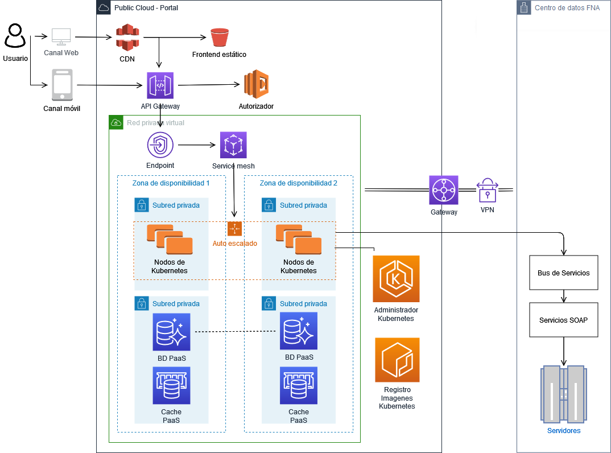

geometry:
  - top=1in
  - bottom=1in
fignos-cleveref: True
fignos-plus-name: Fig.
fignos-caption-name: Imagen
tablenos-caption-name: Tabla
...

## Objetivo del Documento
Entrega de los productos de la Etapa 2, PR11 y PR12, del proyecto PR02, Gobierno SOA del FNA, flujos de trabajo y personas que ejercitan y conforman (cumplen) con el gobierno SOA del FNA a desplegar a cargo de la oficina de arquitectura.

##  Control de Cambios {.page_break_before}
| Tema           | PRY01 Gobierno SOA FNA     |
|----------------|----------------------------|
| Palabras clave | SOA, E-Service, FNA, Análisis de brecha, GAP, Comparativa              |
| Autor          |                            |
| Fuente         |                            |
| Versión        | 1.fc6ac1c del 27 Jul 2023 |
| Vínculos       | [N003a Vista Segmento SOA FNA](N03a%a20Vsta%20aSegenta%20SOA%20FNA.md) |

 

 

## Contenidos
\toc

\newpage

>    E-Service. Fase II
> 
>    PRY01. Gobierno SOA del FNA. Contenido de los Productos Contractuales
> 
>    Contrato 1812020
> 
>    FNA, Stefanini
> 
>    27 Jul 2023
>
>    **Versión** 1.fc6ac1c

 

# Producto 11: 
La arquitectura SOA de referencia SOA 2.0 del FNA, objeto de este proyecto, la forman las estructuras e integraciones de productos y servicios SOA. Esta es el soporte de decisiones de la Vicepresidencia de tecnología del FNA, tanto de desarrollo, mejoras a las aplicaciones y herramientas de software del FNA, y para la adquisición y migración de tecnologías específicas. 

Este producto define los elementos mínimos para garantizar la vigencia y ejercicio de la arquitectura de referencia SOA, objeto de este proyecto, y línea base para dirigir el diseño, desarrollo y entrega de los servicios SOA y tecnologías del FNA.

 

## Justificación
Los objetivos del Gobierno SOA del FNA (Proyecto 1, E-Service, Fase II): Mantenimiento de Relación Negocio - Arquitectura (G-OBJG), y Seguimiento a cambios en la arquitectura de referencia (G-OBJS3) exigen la mantenibilidad de la arquitectura de referencia, responsable de 1) dirigir y evolucionar las soluciones tecnológica del FNA, 2) de orientar el diseño de las estas, y 3) ser el instrumento de control para hacer cumplir los principios de diseño de servicios SOA del FNA y del Manual de Gobierno. Para lograr estos objetivos y responsabilidades dadas, es necesario que desde este proyecto se detallen los recursos, herramientas, roles, responsabilidades y participantes que garanticen que los procesos y operaciones de gestión, cambio y vigencia de la arquitectura de referencia sean puestos en marcha cuando el FNA así lo considere.

## Contenidos
1. Flujo de trabajo del mantenimiento de la arquitectura de referencia (Oficina de Arquitectura del FNA)
1. Principios y operaciones de mantenimiento de la arquitectura de referencia (Oficina de Arquitectura del FNA)
1. Matriz de responsabilidades del mantenimiento de la arquitectura de referencia (Oficina de Arquitectura del FNA)

 

## Criterios de Aceptación
* Entendimiento de las operaciones y mantenibilidad de la arquitectura de referencia SOA 2.0 del FNA
* Matriz de roles y procedimientos encargados de mantenibilidad de la arquitectura de referencia SOA 2.0

 

## Modelo de Implementación del PRY01
{#fig: width=}

_Fuente: Elaboración propia._

 

\newpage

| Tema           | : **Flujo de trabajo del mantenimiento de la arquitectura de referencia** |
|----------------|----------------------------------------------------------------------|
| Palabras clave | SOA, Arquitectura de referencia, Flujo de trabajo, tareas, actividades, roles, acciones                    |
| Autor          |                                                              |
| Fuente         |                                                              |
| Versión        | **1.fc6ac1c** del 27 Jul 2023                       |
| Vínculos       | [Ejecución Plan de Trabajo SOA](onenote:#N001d.sharepoint.com); [Procesos de Negocio FNA](onenote:#N003a.com)|

 

# Separación de Conceptos y Procesos de Arquitectura e Ingeniería
Iniciamos por separar los conceptos pertinentes a la arquitectura y a la ingeniería para luego desarrollar con claridad y mayor libertad los temas de la primera, como son el flujo de trabajo de mantenimiento de arquitecturas.

Definimos en este proyecto a la gestión de las arquitecturas de referencia del FNA como un enfoque centrado en modelos para desarrollar, mantener y entregar soluciones de arquitectura independiente de otros métodos y productos de la ingeniería de sistemas. Distinto a esta última, el foco de la arquitectura no es la construcción, _si no que esta se enfoca más en el conjunto integrado de propiedades sistémicas que en los aportes de las ingenierías individuales_, que son las que implementan y despliegan los artefactos ejecutables.

    Importante. La distinción de la arquitectura (respecto de la ingeniería), en este contexto, es el foco en integrar propiedades de los sistemas, y la optimización de estos, entre todas las contribuciones de ingenierías independientes, como datos, infraestructura, redes, entre otras.

Sin perjuicio de esta separación que establecemos para el trabajo de este proyecto, la gestión y desarrollo de arquitecturas de referencias (en adelante arquitectura de referencia FNA, que incluye en el alcance de este proyecto a servicios SOA, herramientas de software y componentes), _por estar inmersa en la disciplina de ingeniería de sistemas, aunque independiente_, hereda muchas de las formas de trabajo de esta última, además de los cuidados de calidad que a esta se le exigen. Por ejemplo, desde la perspectiva de sistemas en la que se encuentra inmersa el desarrollo de arquitecturas del FNA, esta hace foco en las propiedades sistémicas (o características de calidad no funcional), entre las que se incluyen a la funcionalidad, estructura, rendimiento, seguridad, confiabilidad.

Esta necesaria separación de conceptos facilita el operar las arquitecturas, y en particular objetivo de este proyecto, las arquitecturas de referencia FNA con mayor libertad y profundidad, lo cual a su vez le reportará a la oficina de arquitectura del FNA las eficiencias específicas de esta disciplina.

# Flujo de Trabajo del FNA para la Creación y Mantenimiento de la Arquitectura de Referencia
Hemos diseñado un flujo de trabajo con características habilitantes para su uso dentro del FNA. Una de estas es la articulación con los otros flujos de trabajo producidos por esta consultoría, E-Service, Fase I y II. Tal es el caso del FLUJO01 y FLUJO02 pertenecientes a la oficina de arquitectura del FNA (ver [Flujos de trabajo FNA](../../fna-dd-f2-e1/content/02n.2b.flujooficarq.md)).

Otra de las características que personalizan a este flujo, (código FLARQ03), de creación y mantenimiento de arquitecturas de referencia del FNA, es que este hace énfasis en la verificación de las arquitecturas, además de su centro que es la especificación de los requerimientos de las arquitecturas de referencia (primera actividad del flujo); característica aquella dirigida a enfrentar las problemáticas que evitan que la arquitectura se vuelva irrelevante dentro de la empresa.

El diagrama siguiente presenta una versión resumida del flujo de trabajo FLARQ03, Creación y Mantenimiento de la Arquitectura de Referencia.

{#fig: width=}

_Fuente: elaboración propia._

La estructura interna del este flujo de trabajo personalizado atiende a tres pilares requeridos para el caso del FNA. La parte inferior de este flujo: Especificación de las arquitecturas (nivel detalle 100); Ingeniería, o entrega a diseños de nivel de detalle 300; y la tercera parte que se encarga de la verificación de los dos anteriores: que las especificaciones coincidan con los diseños de solución.

Presentamos una ilustración con las partes de la estructura interna a la que responde el flujo de trabajo del mantenimiento de las arquitecturas FNA.

{#fig: width=}

_Fuente: elaboración propia._

Finalmente, los requerimientos que se pueden solicitar a la arquitectura de referencia y para los que funciona mejor el flujo de trabajo FLARQ03 descrito son los siguientes: 

* transiciones
* migraciones
* interfaces
* reformas
* controles
* integración
* análisis
* simplificación (también conocido como aumento de la confiabilidad)

**Nota**: otros tipos de requerimientos se pueden agregar sin perjuicio de estos.

 

## (Paso 1) Especificaciones de Arquitectura Referencia
Describiremos el paso 1 del flujo de trabajo presentado en esta sección. La importancia de este frente a los otros es que es una actividad nueva para los involucrados en la oficina de arquitectura, motivo por el cual hacemos la descripción únicamente a este paso.

1. (una vez cuente con la información de entrada, es decir, las brechas que el actor de negocio provee) Identificar las declaraciones generales y las **relaciones fundamentales**.
     Ejemplo:
     • La aplicación 1, ejemplo, debe estar asignada a un servicio _Nombre/Id. del Servicio_ que la ejecuta.
     • La aplicación 1, debe estar asignada a los componentes _Nombre/Id. del Componente_ que la soportan.
     • La aplicación 1, responde a los eventos de negocio _Nombre/Id. del Evento_.

2. Elaborar el metamodelo textual focalizado basado en las declaraciones anteriores
     Ejemplo:
     • La aplicación 1 está asignada al servicio _Nombre/Id. del Servicio_.
     • La aplicación 1 se compone de _Nombre/Id. del Componente_.
     • La aplicación 1 responde al evento _Nombre/Id. del Evento_.

3. Elaborar el diagrama por cada declaración del metamodelo (por cada relación)

## Procedimientos Internos para la Gestión de las Arquitecturas de Referencia FNA
El flujo de trabajo propuesto arriba facilita la ejecución de procedimientos todos necesarios para dar cumplimiento a su objetivo central sobre las arquitecturas de referencia del FNA: crea y mantenerlas.

Estos procedimientos facilitadores son:

1. Gestión del trabajo de arquitectura
1. Medición del progreso del trabajo
1. Exploración de riesgos técnicos de las arquitecturas de referencia
1. Descomposición del trabajo
1. Organización de elementos y modelamiento
1. Emisión de transiciones de las arquitecturas de referencia *

  

* Este último de vital importancia para la gestión de la implementación de las arquitecturas de solución derivadas de las referencias del FNA.

 

### Gestión del Trabajo de Arquitectura
Bajo el principio de mantener simple los procesos y procedimientos para que puedan ser llevados a la práctica, definimos la gestión de los trabajos requeridos para mantener a las arquitecturas de referencia FNA como un pila (conjunto) priorizada de ítems de trabajo de arquitectura (ITA, en adelante) que contiene y comunica únicamente el trabajo por realizar. Esta pila de trabajo, que es distinto a un plan de trabajo tradicional, funciona como una previa de este. En nuestro contexto, el plan de trabajo tradicional toma como base a la pila de trabajo y para dividirse en otros dos, que son el plan de iteración y el plan de liberaciones.

Un ITA (ítem de trabajo de arquitectura) puede ser cualquiera de los requerimientos de trabajo para los que el flujo FLARQ03 está optimizado, esto es, transiciones, interfaces, reformas, controles, integraciones, análisis o simplificaciones. Otros tipos de requerimientos se pueden agregar al flujo de trabajo sin perjuicio de estos.

 

### Medición del Progreso del Trabajo
El trabajo de las arquitecturas de referencia del FNA debe ser medido para que sea a la vez mejorado. En esta sección nos referimos puntualmente a la mejora del trabajo de arquitectura entendido como el (primero) desarrollo y gestión de las arquitecturas de transición: cambio estable de una versión a otra; y (segundo) a la transición del diseño a la implementación. Para conseguir esta mejora y aprovechar oportunidades es necesario desarrollar métricas para estos dos aspectos del trabajo de arquitectura que den indicios de cambiar las actividades y el cómo las estemos haciendo.

Un aspecto de control que es clave para la fijación de las métricas de mejoramiento sobre estos dos trabajos de arquitectura declarados aquí es la correlación con los objetivos. Las métricas que se definan no son objetivos, pero deben estar correlacionadas con estos.

Proveemos algunos ejemplos de métricas que se correlacionen con los objetivos de los trabajos de arquitectura arriba mencionados.

| Objetivo       | Métrica                          | Observación               |
|----------------|----------------------------------|---------------------------|
| Tamaño de la arquitectura | Cantidad de componentes y relaciones | La cantidad de componentes y de relaciones puede dar una idea de la complejidad, aunque no siempre es una implica a esta. |
| Productividad  | Velocidad de transición | La velocidad por sí sola no imcorpora a la complejidad. Esta métrica debe ser interpretada en conjunto con otras que sí traten a la compledidad para contar con una interpretación ponderada de la productividad. |
| Eficiencia     | Costo por transición | Puede haber problemas de subjetividad cuando la dificultad para contabilizar los costos, o sopesarlos contra los beneficios, es alta. |
| Calidad de transición | Densidad de desviaciones | Puede que sea complejo determinar cómo encontrar estas desviaciones del diseño y la implementación y la frecuencia con la que se los busca. Según la manera como se concrete, esta métrica puede afectar a la de eficiencia. |

Table: Ejemnplo de métricas para el trabajo de arquitectura: transición de versión y transición de diseños. {#tbl:metricas-id}

 

\newpage

| Tema           | : **Flujo de trabajo del mantenimiento de la arquitectura de referencia** |
|----------------|----------------------------------------------------------------------|
| Palabras clave | SOA, Arquitectura de referencia, Flujo de trabajo, tareas, actividades, roles, acciones                    |
| Autor          |                                                              |
| Fuente         |                                                              |
| Versión        | **1.fc6ac1c** del 27 Jul 2023                       |
| Vínculos       | [Ejecución Plan de Trabajo SOA](onenote:#N001d.sharepoint.com); [Procesos de Negocio FNA](onenote:#N003a.com)|

 

# Principios de Mantenimiento de la Arquitectura de Referencia 2.0 del FNA
En este contexto vamos a definir al agilismo como un método (distinto a disciplina, o proceso) para conseguir la calidad de los productos de arquitectura, no para acelerar desmesuradamente las actividades de la oficina [ver Procesos de Arquitectura]. Desde esta definición reforzaremos el flujo de trabajo del mantenimiento de una arquitectura (descrito en [Flujo de Trabajo del FNA para el Mantenimiento de la Arquitectura de Referencia]) con principios que procuren el fin último del método propuesto: la calidad de los diseños (por encima la velocidad de los procesos).

Los principios del FNA necesarios para el mantenimiento de una arquitectura son los siguientes.

1. Arquitectura incremental
1. Verificación continua de arquitecturas
1. Generación continua de arquitecturas
1. Diseños enfocados (baja granularidad) --evite diseños de largo plazo
1. Coautoría de trabajo con interesados

 

\newpage

| Tema           | : **Flujo de trabajo del mantenimiento de la arquitectura de referencia** |
|----------------|----------------------------------------------------------------------|
| Palabras clave | SOA, Arquitectura de referencia, Flujo de trabajo, tareas, actividades, roles, acciones                    |
| Autor          |                                                              |
| Fuente         |                                                              |
| Versión        | **1.fc6ac1c** del 27 Jul 2023                       |
| Vínculos       | [Ejecución Plan de Trabajo SOA](onenote:#N001d.sharepoint.com); [Procesos de Negocio FNA](onenote:#N003a.com)|

 

# Matriz de Responsabilidades para el Mantenimiento de las Arquitecturas de Referencia del FNA
Los roles y responsabilidades de esta sección siguen lo descrito por el flujo de trabajo FLARQ03 del FNA, [Flujo de Trabajo del FNA para la Creación y Mantenimiento de la Arquitectura de Referencia]. Esto es, esta matriz de roles sigue la siguiente estructura

1. Especificaciones de arquitectura (referencia)
1. Ingeniería (diseños de solución)
1. Verificación especificación- diseño

 

# Roles y Responsabilidades de la Oficina de Arquitectura
## Responsabilidades por Rol
Partimos de la estructura de la matriz indicada arriba.

| Nombre                                         | Tipo                      | Responsabilidades |
|:-----------------------------------------------|:--------------------------|:---------------  |
| **Actores Áreas FNA**                          | business-actor            | Identifica brechas y determina necesidades y señalamientos a las arquitecuras actuales  |
| **Arquitecto SOA FNA**                         | business-actor            | Inicia el flujo de trabajo de mantenimiento de las arquitecturas. Realizar las especificaciones de primer nivel (nivel de detalle 100) |
|||                                                                            - **Verificación**: elaborar los registros de colaboración entre arquitectura e ingeniería |
| **Arquitecto Solución**                        | business-actor            | Implementar los diseños provistos por la oficina de arquitectura del FNA apegadas a tecnologeias específicas |
|||                                                                            - Contribuir con el nivel de detalle de los modelos provistos por el Arquitecto SOA FNA (nivel 300)|
|||                                                                            - Realizar las actividades de análisis exigidas por el gobierno SOA |
|||                                                                            - **Verificación**: elaborar los registros de colaboración entre arquitectura e ingeniería |
| **Ingeniería FNA**                             | business-actor            | Implementa los cambios y transiciones de las arquitecturas de referencia FNA |
|||                                                                            - Elaborar los artefactos ejecutables exigidos por la transición |
|||                                                                            - Contribuir con el nivel de detalle de los modelos provistos por el Arquitecto SOA FNA (nivel 500) |

Table: Roles y Responsabilidades del (FLARQ03) Flujo de Trabajo Creación y Mantenimiento de Arquitecturas de Referencia FNA ejecutada por la Oficina de Arquitectura FNA exigidos por el Gobierno SOA. {#tbl:rolresp-id}

 

\newpage

>    E-Service. Fase II
> 
>    PRY01. Gobierno SOA del FNA. Contenido de los Productos Contractuales
> 
>    Contrato 1812020
> 
>    FNA, Stefanini
> 
>    27 Jul 2023
>
>    **Versión** 1.fc6ac1c

 

# Producto 12: PR12. 
La arquitectura de referencia SOA 2.0 del FNA, objeto de este proyecto, la forman las estructuras e integraciones entre datos, productos y servicios SOA. Virtus de esto, es el soporte de decisiones de la Vicepresidencia de tecnología del FNA, tanto de desarrollo, mejoras a las aplicaciones y herramientas de software del FNA, y para la adquisición y migración de tecnologías específicas.

Este producto del proyecto define la línea base de la arquitectura de referencia 2.0 del FNA, necesaria para dirigir el desarrollo de los servicios SOA del FNA hacia diseños y tecnologías determinadas en este plano de referencia (como microservicios, REST, API, infraestructura Nube, etc.) y favorece la adopción del _estilo de arquitectura orientado a eventos_ para atender las funcionalidades y necesidades de negocio, que para este proyecto son prioridad la vicepresidencia de operaciones y la vicepresidencia de crédito del FNA.

 

## Justificación
La Arquitectura de Referencia SOA 2.0 del Fondo Nacional del Ahorro (PR12), que incorpora las problemáticas de gobierno SOA a partir de las que se plantea este producto, busca la prevalencia, el fortalecimiento y la optimización de las arquitecturas de servicios SOA relacionadas con las aplicaciones del FNA, y en concordancia con los análisis realizados en la Fase I, E-Service (2022). Esta permitirá, una vez modelada la arquitectura de objeto de referencia de este proyecto, realizando las operaciones requeridas por el proyecto Gobierno SOA del FNA (PRY01, E-Service Fase II) a los segmentos y componentes base, principios, metodologías, estándares, lineamientos y tecnologías.

La Arquitecturas de referencias 2.0 es la responsable de definir y evolucionar las arquitecturas de solución tecnológica del FNA, y su propósito es orientar el diseño de las soluciones delimitando e introduciendo restricciones positivas en cuanto a parámetros, patrones y atributos de calidad. Además, es un instrumento de control para hacer cumplir los principios de diseño de servicios SOA del FNA y del Manual de Gobierno.

## Contenidos
1. Diseño y representación de la Arquitectura de Referencia 2.0 del FNA
2. Consideraciones para implementar la arquitectura de referencia
3. Vistas lógicas y conceptuales de los sistemas de información
4. Documentación técnica 0.1 de la Arquitectura de Referencia 2.0 del FNA

 

## Criterios de Aceptación
* Vistas lógicas y conceptuales de los sistemas de información
* Validación de la Arquitectura de Referencia 2.0 del FNA [- Plantilla "Gestión y Gobierno Arquitectura Empresarial (Mega Hopex) MIPG, MRAE, Marco Transformación Digital, TOGAF"]

 

## Modelo de Implementación del PRY01
{#fig: width=}

_Fuente: Elaboración propia._

 

\newpage

| Tema           | : **Flujo de trabajo del mantenimiento de la arquitectura de referencia** |
|----------------|----------------------------------------------------------------------|
| Palabras clave | SOA, Arquitectura de referencia, características, dominios, servicios, aplicaciones, datos, |
| Autor          |                                                              |
| Fuente         |                                                              |
| Versión        | **1.fc6ac1c** del 27 Jul 2023                         |
| Vínculos       | [Ejecución Plan de Trabajo SOA](onenote:#N001d.sharepoint.com); [Procesos de Negocio FNA](onenote:#N003a.com)|

 

# Diseño y Representación de las Arquitecturas de Referencia 2.0 del FNA
Partimos de la representación de la vista general actual de la arquitectura del FNA y que implica a las problemáticas diagnosticadas en Fase I @eservices1-22. Sobre este plano realizaremos luego las propuestas de nuevas arquitecturas respecto a la actual dirigidas a enfrentar dichas problemáticas allí planteadas, y que se resumen en las siguientes.

1. Dependencia de proveedor (OBJ1)
1. Fortaleza SOA de las aplicaciones (OBJ2)
1. Tiempo de mercado (OBJ3)

_Fuente: E-Service, Fase I (2022)._

## Dominio de Servicios y Aplicaciones FNA
### Plano General Actual 
El propósito de traer como referencia el plano actual de arquitectura del FNA es recordar dicho esquema  para poderlo comparar con la arquitectura propuesta.

{#fig: width="12in" height="7in"}

 

### Plano General Objetivo
Presentamos la arquitectura de referencia propuesta dividida en dos niveles de detalle.

#### Nivel de detalle 1

{#fig: width="13in" height="7in"}

 

#### Nivel de detalle 2

{#fig: width="13in" height="7in"}

 

## Dominio de Datos FNA
Para la arquitectura SOA objetivo se propone un enfoque conocido como malla de datos. Este paradigma permite pensar en los datos como productos: disponibles y gestionados para su consumo como un producto. La malla de datos introduce cambios organizativos y de procesos que el Fondo Nacional necesitará para gestionar los datos como un activo de capital tangible del negocio.

Una malla de datos tiene como principal objetivo que estos sean más accesibles y estén disponibles para los usuarios, conectando directamente a propietarios, los productores y los consumidores de datos. La malla de datos trae beneficios como la mejora de los resultados empresariales de las soluciones centradas en los datos, y también impulsa la adopción de arquitecturas de datos modernas.

### Pilares de la Malla de Datos (data mesh)
{#fig: width="6in" height="3in"}

### Plano de Datos Objetivo (data mesh)
El desarrollo de la arquitectura candidata de información integrará los marcos de referencia TOGAF, el marco de referencia DAMA y las disposiciones de la política de gobierno digital, en particular las
especificadas por el Marco de Referencia de Arquitectura Empresarial para entidades del Estado Colombiano - MRAE para orientar la evaluación del estado actual y la definición del estado deseado integrando
capacidades para el gobierno de datos, arquitectura de datos, diseño y modelamiento de datos, operaciones y almacenamiento de datos, seguridad de datos, interoperabilidad e integración de datos, gestión documental y contenido, datos maestros y de referencia, inteligencia de negocios y analítica, metadatos y calidad de datos.

{#fig: width="6in" height="3.5in"}

La Ilustración a continuación muestra los marcos de referencia aplicables al dominio de Información:

{#fig: width="6in" height="2.4in"}

### Características Principales de la Arquitectura de Datos 2.0 del FNA
**Propiedad impulsada por el dominio**: el primer principio de un data
mesh es transferir el poder de los datos y su propiedad a las manos de los equipos de dominio del FNA, es decir a las vicepresidencias y sus departamentos y unidades de negocio. Ellos serán los dueños de los datos de un extremo a otro, y podrán asegurarse de tener desde las fuentes correctas hasta los procesamientos necesarios y la entrega de los datos para que otros equipos de dominio los aprovechen como productos.

**Datos como producto:** los equipos de dominio son responsables de los datos y también de los productos de datos resultantes. El objetivo es lograr que cada "producto de datos" sea descubierto y utilizable por los consumidores y otros equipos de dominio, y el propietario del dominio es responsable de mantener y actualizar (o desaprobar) estos productos para garantizar la calidad y la precisión.

**Infraestructura de autoservicio**: autoservicio es la tendencia a dejar las tecnologías complejas y las
habilidades de nicho. El Data mesh se basa, por principio, en una gestión de datos mediante una plataforma común y un conjunto de herramientas que cualquier equipo de dominio pueda aprovechar.

**Gobernanza federada**: si de verdad debemos eliminar controles de acceso necesitamos un equilibrio entre las políticas y controles de gobernanza global y la posibilidad de dominio y creación de productos. Esto es lo que llamamos gobernanza federada, y en la práctica es fundamental para garantizar la privacidad, el cumplimiento y la posibilidad de escalar.

## Dominio de Infraestructura FNA
Para la arquitectura SOA objetivo se propone un enfoque de computación en la nube donde se hace uso de componentes IaaS y PaaS. Dentro de la oferta actual de componentes se pueden encontrar soluciones que permiten garantizar escalabilidad, disponibilidad, cumplimiento regulatorio y menores tiempos de salida al mercado.

 

### Arquitectura Objetivo
En respuesta a las necesidades determinadas en los diagnósticos de Fase I, proponemos una base de infraestructura futura, pero compatible con el contexto actual del FNA. Por tanto, esta propuesta se centra en el estilo de arquitectura SOA mejorado con la malla de servicios y microservicios elásticos (auto escalado).

{width="6.1in" height="3.5in"}

A continuación resaltamos algunas características de interés respecto de los problemas que esta arquitectura soluciona.

 

### Principales Características

**Arquitectura sin servidor para la interfaz web**: Distribución de contenidos con baja latencia y altas velocidades de transferencia usando CDN hospedando el contenido estático de la aplicación en un servicio de almacenamiento de objetos, eliminando la necesidad de utilizar servidores en esta capa.

**Enfoque de microservicios**: Permite obtener capacidad de cómputo particular según sea requerido para soportar la carga. 

**Exposición de la funcionalidad de negocio a través de API Gateway**: Entrega las solicitudes a los microservicios, habilitando la gestión de API para establecer modelos de Calidad en el Servicio (QoS) y controlando la autenticación y autorización.

**Orquestación de contenedores**: Los administradores de Kubernetes permiten automatizar tareas clave como los parches, el aprovisionamiento de nodos y las actualizaciones. El gestor de Kubernetes por lo general permite  gestionar dinámicamente la creación o terminación de nodos y contenedores en base a la demanda.

**Service mesh**: Permite distribuir la carga proveniente de API Gateway, obteniendo mayor visibilidad y controles uniformes del tráfico de red.

**Servicios administrados**: Se aprovechan para elementos tales como la gestión de cache y bases de datos (relaciones y no relacionales). Con esto se evitan  tareas administrativas, como el aprovisionamiento de hardware, parches de software, configuración, ajustes, recuperación de fallos y backups.

**Integración de sistemas**: A través de un enlace Virtual Private Network (VPN) La funcionalidad se expone a través del Bus de Servicios, habilitando un modelo híbrido de aplicaciones nativas de nube y al mismo tiempo de arquitectura orientada a servicios (SOA).

\newpage

| Tema           | : **Consideraciones para implementar la arquitectura de referencia** |
|----------------|----------------------------------------------------------------------|
| Palabras clave | SOA, Arquitectura de referencia, características, implementación, hoja de ruta,  |
| Autor          |                                                              |
| Fuente         |                                                              |
| Versión        | **1.fc6ac1c** del 27 Jul 2023                         |
| Vínculos       | [Ejecución Plan de Trabajo SOA](onenote:#N001d.sharepoint.com); [Procesos de Negocio FNA](onenote:#N003a.com)|

 

# Consideraciones para Implementar las Arquitecturas de Referencia del FNA
Partimos de la representación de la vista general de arquitectura actual del FNA, que desembocaron en las problemáticas diagnósticadas en Fase I (@eservices1-22) sobre la que realizaremos luego las propuestas de nuevas arquitecturas que 

Este documento presenta la visión general de la arquitectura de referencia del FNA. Contiene propuestas a futuro sobre los cambios y adiciones sugeridas con respecto a la arquitectura de referencia actual.

\newpage

| Tema           | : **Flujo de trabajo del mantenimiento de la arquitectura de referencia** |
|----------------|----------------------------------------------------------------------|
| Palabras clave | SOA, Arquitectura de referencia, características,                     |
| Autor          |                                                              |
| Fuente         |                                                              |
| Versión        | **1.fc6ac1c** del 27 Jul 2023                       |
| Vínculos       | [Ejecución Plan de Trabajo SOA](onenote:#N001d.sharepoint.com); [Procesos de Negocio FNA](onenote:#N003a.com)|

 

# Diseño y Representación de las Arquitecturas de Referencia 2.0 del FNA
Partimos de la representación de la vista general de arquitectura actual del FNA, que desembocaron en las problemáticas diagnósticadas en Fase I (@eservices1-22) sobre la que realizaremos luego las propuestas de nuevas arquitecturas que 

Este documento presenta la visión general de la arquitectura de referencia del FNA. Contiene propuestas a futuro sobre los cambios y adiciones sugeridas con respecto a la arquitectura de referencia actual.

\newpage

# Referencias {.page_break_before}
<!-- Explicitly insert bibliography here -->

@eservices1-22 @eservices3-22 @eservices4-22 @eservices5-23 @eservices6-12 @eservices7-23 @bptrends07

